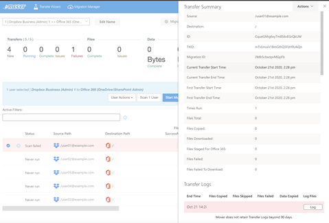

# Troubleshooting post-migration

>[!Important]
>**Mover is now retired for all Admin led migrations**. The ability to migrate from Google Drive, Box, Dropbox, and Egnyte has been fully integrated into Migration Manager. For full details see: [Mover retirement timeline](mover-retirement-timeline.md).  Migration Manager does not support the migration of Amazon S3 or Azure blob storage.
>
>All FastTrack-led migrations have transitioned to Migration Manager.
>
>**Tenant to tenant migration**. Cross-tenant OneDrive migration is now available outside of Migration Manager. Learn more here: [Cross-tenant OneDrive migration](/microsoft-365/enterprise/cross-tenant-onedrive-migration).  
>
>A cross tenant migration solution for SharePoint is currently being developed and in private preview.  To learn more, see [How to participate in the Cross-tenant SharePoint migration preview](/microsoft-365/enterprise/cross-tenant-sharepoint-migration).

## General troubleshooting

Follow these steps if your migration is having issues:

1. Rerun users. Select one or more users and to rerun them, on the top right of the **Migration Manager**, select **Start Migrating**.
2. To view your most recent transfer log, select the user row you want to view. This action opens the **Transfer Logs** sidebar. From here, select the **View Log** button for the most recent transfer.

Alternatively, you can select multiple users, and from the **User Actions** dropdown menu, you can download their most recent collective logs in a zip file that provides them in both HTML and CSV formats.

3. Check if your failed/unsupported files are too large to go into Office 365.
4. Ensure you have enough storage space in Office 365 to accommodate the data you're moving in.
5. Think files are missing? Check out our list of **Unsupported Files per Connector**.

## Incremental feature

Our incrementals are delta operations which compare files in your source to files in Office 365. Using this comparison, we copy anything that is new or has changed. This enables us to keep Office 365 data up to date when the very final cut-over of users occurs. These incremental passes are an important part of our process.

**Technical clarification**: We compare what you have in your source to what is in Office 365 and we only transfer anything that doesn't already exist, or has a newer timestamp.

### 'Lost files'

During a transition where sharing paradigms change, there are many users who claim, “My files are lost!”

This is common if they are not in clear communication about how the sharing structure changes when they log in to Office 365. This can be mitigated with a clear communication strategy.

### Waiting for Microsoft

After all your files have been uploaded to Microsoft, the status of the transfer changes from *Running* to *Waiting for Microsoft*. We must wait for Microsoft to complete their processing.

It is normal for this process to take a few hours, and ultimately depends on how much data there is to process.

### Document parser error

Large HTML or XML documents (256MB+) fail to transfer if the **Document Parser** is enabled for the destination site during the migration.

The following error appears:

`File too large for Microsoft Doc Parser. Please contact Microsoft support and request the Doc Parser be disabled for this site.`

If this error message appears, you must contact Microsoft support directly to disable the **Document Parser** on the target site for the duration of the migration.

If you require assistance with your communication strategy, ask us for help.
