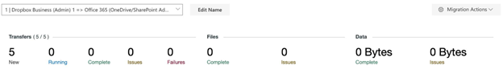

# Reports

## Dashboard overview

The dashboard statistics given at the top of the **Migration Manager** provide a visual summary of your overall migration. This includes the number of users in the current selected migration, the number of files scanned or transferred, and the amount of data scanned or transferred; as well as any issues, errors, or failures that may have occurred.

## Transfers

The **Transfers** section of the **Migration Manager** dashboard provides a brief rundown of all user transfers and scans.

- **New**: Number of individual users that have yet to be scanned or transferred.
- **Running**: Number of users that are currently running either a scan or a transfer.
- **Complete**: Number of users that have successfully completed scans or transfers.
- **Issues**: Number of users that encountered errors during a scan or a transfer.
- **Failures**: Number of users that failed to scan or transfer.

>[!Note]
>The total **Transfers** tally is from all users regardless of status.

## Files

The **Files** section of the **Migration Manager** dashboard provides a total of all files scanned and transferred across all users in a migration.

- **Complete**: Number of files that have successfully scanned or transferred.
- **Issues**: Number of files that have encountered issues and failed to scan or transfer.

>[!Note]
>The total number of **Files** is from both scanned and transferred users. Be aware that scanned files are marked as *Skipped* as they have yet to be transferred.

## Data

The **Data** section of the **Migration Manager** dashboard shows the total of all data scanned and transferred across all users in a migration.

- **Complete**: Amount of data that has been successfully scanned and transferred.
- **Issues**: Amount of data that encountered issues and has failed to scan or transfer.

>[!Note]
>The total amount of **Data** is from both scanned and transferred users. Be aware that scanned data is marked as *Skipped* as it has yet to be transferred.

## Active filter list

This provides the list of all current **Filters** that you can apply to the **Active Filter** search bar.

>[!Note]
>Applying the filters changes the statistic shown in the **Migration Manager** dashboard.

|**Filter label**|**Label effect**|
|:-----|:-----|
|Status|	Filters by status [for example, Failed, Success, User Does Not Exist, and so on.]|
|Files|	Filters based on files transferred, failed, and skipped.|
|Data	|Filters based on data that has transferred, failed, or skipped.|
|Success|	Displays all successful Data and Files transferred.|
|Failed	|Displays all Data and Files that have failed to transfer.|
|Skipped	|Displays all data and files that were skipped.|
|Schedule	|Displays all users with scheduled transfers [for example, Hourly, Daily, Weekly, Monthly].|
|Path	|Filters for specific source or destination path [for example, path:username].|
|Destination|	Filters for specific destination path [for example, path:@domain<spam><spam>.com].|
|Source|	Filters for specific source path [for example, path:foldername].|
|Destination path	|Functions the same as **Destination**.|
|Source path	|Functions the same as **Source**.|
|Tags	 |Lists transfers with previously implemented custom tags.|
|Notes	|Filters by keywords in previously implemented custom notes.|
|Code|	Filters for specific status codes.|
|Destination name|	Displays transfers with a specific destination name.|
|Source name|	Displays transfers with a specific source name.|

## Scan report

For more information about the scanning process, see the **Scanning** section.

After the scan report is downloaded and opened, look for these key items:

- Users with a failed status. We recommend rerunning the scan for these user(s).
- Users with one file or less. **Note**: Sharing permissions are still transferred.
- Users with the most data. Use this information to decide about a data distribution strategy that suits your needs. For more info about data distribution, see **here**.

## Migration report

The **Migration Report** provides an in-depth overview of your entire migration, including (but not limited to) speed and time statistics, totals for files and data transferred, and info relating to the latest run.

To download this as a CSV, at the top right of the **Migration Manager**, select the **gear** icon, and select **Migration Report**.

The CSV report provides the following information for each user pairing:

|Header Statistic|Definition|
|:-----|:-----|
|Schedule ID|Our internal reference unique to the user pairing created.|
|Source|Source directory path.|
|Destination|Destination directory path.|
|Tags|If you have used our tags feature, you'll see them here. Use tags to differentiate operational departments, to flag specific users, and so on.|
|Notes|If you have added Notes to user pairings in the **Migration Manager**, they'll appear here, for example, *Remind me to check the logs on this user* or *Weird folder problem - ask support*.|
|First Run Start|When the first transfer for this user pairing began.|
|Files Transferred|Total files transferred to the destination.|
|Bytes Transferred|Total data (bytes) transferred to the destination.|
|MB Transferred|Total data (MB) transferred to the destination.|
|Total Duration|Total duration of each time this user pairing has been run.|
|Times run|Total number of times this user pairing has been run.|
|Last Status|Last status of the user pairing. This is also reflected by the color of each row in the **Migration Manager**. Examples include *Success*, *Some Problems*, *Failure*.|
|Last Status Code|Internal reference number referring to the last status of the user pairing.|
|Last Successful Files|Number of files transferred in the last run.|
|Last Successful Bytes|Volume of data (bytes) transferred in the last run.|
|Last Successful MB|Volume of data (MB) transferred in the last run.|
|Last Files Skipped|Number of skipped files in the last run.|
|Last Bytes Skipped|Volume of data (bytes) skipped in the last run.|
|Last MB Skipped|Volume of data (MB) skipped in the last run.|
|Last Files Unsupported|Number of files unsupported either in the source or destination in the last run.|
|Last Failed Files|Number of files that failed to transfer in the last run.|
|Last Folders Listed|Number of folders that we opened/created in the last run.|
|Last Folders Failed|Number of folders that we failed to open/create in the last run.|
|Last Run Start|When the latest transfer on this user pairing began.|
|Last Run End|When the latest transfer on this user pairing finished.|
|Last Run Duration|How long the latest transfer for this user pairing took to complete.|
|Last File Velocity (files/hour)|Files transferred, divided by the total duration for the last run.|
|Last Data Velocity (Bytes/hour)|Data (bytes) transferred, divided by the total duration for the last run.|
|Last Data Velocity (MB/hour)|Data (MB) transferred, divided by the total duration for the last run.|
|Average File Velocity (files/hour)|Files transferred, divided by the total duration.|
|Average Data Velocity (Bytes/hour)|Data (bytes) transferred, divided by the total duration.|
|Average Data Velocity (MB/hour)|Data (MB) transferred, divided by the total duration.|
|Completed Files Transferred|Total files transferred to the destination in the last run that finished with status code 1xx (successful) or 2xx (some errors). If and only if the "Last Status Code" is in the 1xx or 2xx ranges, this will refer to the latest run; otherwise it will refer to a previous run. If this is zero, it may mean that the schedule has not been run to completion before.|
|Completed Bytes Transferred|Total data (bytes) transferred to the destination in the last run that finished with status code 1xx (successful) or 2xx (some errors).  If and only if the "Last Status Code" is in the 1xx or 2xx ranges, this will refer to the latest run; otherwise, it will refer to a previous run. If this is zero, it may mean that the schedule has not been run to completion before.|
|Completed MB Transferred|Total data (MB) transferred to the destination in the last run that finished with status code 1xx (successful) or 2xx (some errors). If and only if the "Last Status Code" is in the 1xx or 2xx ranges, this will refer to the latest run; otherwise, it will refer to a previous run. If this is zero, it may mean that the schedule has not been run to completion before.|
|Completed Successfully Files Transferred|Total files transferred to the destination in the last run that finished with status code 1xx (successful). If and only if the "Last Status Code" is in the 1xx range, this will refer to the latest run; otherwise, it will refer to a previous run. If this is zero, it may mean that the schedule has not been run to successful completion before.|
|Completed Successfully Bytes Transferred|Total data (bytes) transferred to the destination in the last run that finished with status code 1xx (successful). If and only if the "Last Status Code" is in the 1xx range, this will refer to the latest run; otherwise, it will refer to a previous run. If this is zero, it may mean that the schedule has not been run to successful completion before.|
|Completed Successfully MB Transferred|Total data (MB) transferred to the destination in the last run that finished with status code 1xx (successful). If and only if the "Last Status Code" is in the 1xx range, this will refer to the latest run; otherwise, it will refer to a previous run. If this is zero, it may mean that the schedule has not been run to successful completion before.|
Download an example CSV:

[example_migration_report.csv](https://github.com/MicrosoftDocs/OfficeDocs-SharePoint/tree/live/migration/downloads/example_migration_report%20.csv)

## Migration table report

The **Migration Table Report** generates an overview of your entire migration based on the custom designated columns you have set.

To edit report columns, in the **Migration Manager**, select **Migration Actions**, and select **Customize Columns**. Here you can set and reorganize which **Columns** you want to display when you download the CSV report.

To download this as a CSV, at the top right of the **Migration Manager**, select the **gear** icon, and select **Migration Table Report**.

Download an example CSV:

[example_migration_table_report.csv](https://github.com/MicrosoftDocs/OfficeDocs-SharePoint/tree/live/migration/downloads/example_migration_table_report.csv)

## Migration error report

The **Migration Error Report** generates a simplified **Migration Report** that focuses on any problematic files, folders, permission errors, or general errors.

To download this as a CSV, at the top right of the **Migration Manager**, select the **gear** icon, and select **Migration Error Report**.

Download an example CSV:

[example_migration_error_report.csv](https://github.com/MicrosoftDocs/OfficeDocs-SharePoint/tree/live/migration/downloads/example_migration_error_report.csv)

## Skipped files and folders

When files and folders are “skipped,” Mover has deliberately skipped that item during the transfer. Typically, items are skipped because:

- That item with the same name and timestamp already exists in the destination.
- They are set to be copied by a different user (to prevent data duplication).
- It was a scan. Items are not copied during a scan.

In the log, a skipped item has a status of either Folder skipped, File skipped or Failure. The Additional info column in the log will give you more insight as to why the item did not migrate.
