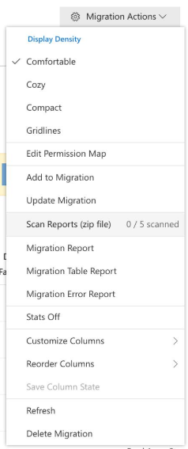
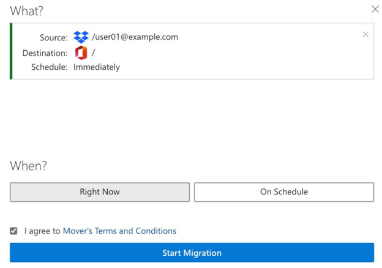

# Running the Mover migration

>[!Important]
>**Mover is now retired for all Admin led migrations**. The ability to migrate from Google Drive, Box, Dropbox, and Egnyte has been fully integrated into Migration Manager. For full details see: [Mover retirement timeline](mover-retirement-timeline.md).  Migration Manager does not support the migration of Amazon S3 or Azure blob storage.
>
>All FastTrack-led migrations have transitioned to Migration Manager.
>
>**Tenant to tenant migration**. Cross-tenant OneDrive migration is now available outside of Migration Manager. Learn more here: [Cross-tenant OneDrive migration](/microsoft-365/enterprise/cross-tenant-onedrive-migration).  
>
>A cross tenant migration solution for SharePoint is currently being developed and in private preview.  To learn more, see [How to participate in the Cross-tenant SharePoint migration preview](/microsoft-365/enterprise/cross-tenant-sharepoint-migration).

## Scanning

Scanning your source data is key to running a smooth and stress-free migration. For the full list of key data necessary for a smooth migration, see this **checklist**.

> [!NOTE]
> Scanned data is marked as *Skipped* as scanning does not transfer data; it simply counts the data that we would normally transfer from the source.
>
> After a transfer is scanned, the source/destination are effectively *locked in.* Be sure to double-check that they are correct, and not left blank.

## Running the scan

You now have a list of users appearing in the migration, complete with destination set up.

To start the scanning source data process:

- Select all users. At the top of the navigation bar, select the checkbox.

After you select all users, select **Scan X Users**.

After the scan has successfully completed, the users appear in green. The scan time varies depending on the data amount in the source.

After users appear in green, yellow, or red, on the top right side of your screen, select **Migration Actions**, and then select **Scan Report**.

> [!NOTE]
> If your scan encounters an error or crashes, our app automatically reruns the scan up to three times to attempt to resolve the issue.

For in-depth info about **Scan Report**, see the **Reports** subsection under the **Scan Report** section of this guide.

## Interpreting Scan Results for Final Delta/Cutover Events

 You or your customer might have a relative idea of how many items and users are in their source domain and how many they might want to migrate. However, it is essential to get an accurate count of your total items/number of users by running an Inventory Scan. This scan will let you know how many items/users are in the domain and help determine who owns the data. To learn more, see [Running a migration inventory scan with Mover](/sharepointmigration/mover-scan).

 Another critical fundamental of running the Inventory Scan is determining the viability of completing a Final Delta or Cutover pass before letting your users start using their OneDrive accounts and SharePoint sites when they switch over to using Microsoft 365.

For migrations, there are two key stages to consider.

- **Migration Sync**. This is where you run the migration, and most of your content is migrated on the first or subsequent passes.  These passes can vary from 1 to many, depending on the amount of content migrated, remediation of failed users, failed files, or new users added during the migration.
- **Final Delta/Cutover**. Once the Migration Sync passes are complete, it is prudent to run a Final Delta/Cutover event.  A final delta cutover event ensures that any new or modified Source content is migrated and that all current content is available for Microsoft 365 users.
Final Delta/Cutover events are typically run over a weekend when your tenant tends to be quieter than the standard working week. It allows time to prepare for users starting to use Microsoft 365 on the Monday after the cutover.

You can use the Scan Results for large migrations to evaluate how many items/users you have to migrate and determine if a single weekend cutover event will complete in the required timeframe.

Currently, the estimated upper limits for completing a Final Delta/Cutover event from Friday to Monday is approximately 100 to 150 million files or 12,000 - 15,000 users.

If your file or user count exceeds these limits, planning should be set early in the migration to address how best to perform the Final Delta/Cutover.

Our recommendation is to split your users by either GEO Region (APAC, EMEA, AMER) or even by Department (HR, IT, Sales etc.) and schedule multiple cutover events to ensure that each Region or Department is completed before the Monday deadline.

You can use the Tagging feature on the Migration tools to help identify by Region or Department and use the Filtering options to help plan, run, and monitor their progress.

## Managing Users Who Own Large Amounts of Data

Upon completing your Scan, download the scan reports and review/address any large Source data owners.

The more users simultaneously being transferred, the higher our throughput for your migration. Users with large data sets should be broken into smaller Service Accounts to facilitate faster transfers.
To maximize throughput, users should not own greater than 400,000 items or 5 TB of data. The more users you have, and the smaller the amounts of data they own, the faster your migration proceeds.

> [!IMPORTANT]
> We recommend 100,000 files or 1 TB per account to aid in faster transfers.

**Examples**:

|Size|Action|
|:-----|:-----|
|If a user owns more than 400,000 items|Divide the items between four users each with 100,000 items.|
|If a user owns more than 5 TB of data|Divide between five users so that each user owns 1 TB. |

To create Service Accounts, work with your Source Cloud Storage Admin to carry out the following steps:

1. Once you have identified a large user, determine how many Service Accounts will be required (see example above).
2. Create the Service Accounts and assign them a license.
3. From the original large user, identify the folder(s) you would like to assign to the Service Account.
4. Change the ownership of said folder(s) to the new Service Account. This may require that the original owner first share it with the new owner and the new owner to accept. The original owner will then have the option to select them as owner.
5. When it comes to migrating the Service Account, create a corresponding OneDrive user/SharePoint site to migrate the new Service Account content to.
6. Before making any changes, you should reach out to your tenant administrator, investigate any source custom solutions or integrations that you might be using, and determine if these ownership changes will have any impact.

When mapping please ensure that each Service Account has its own unique matching Destination account to optimize performance.

|Source Path|Destination Path |
|:-----|:-----|
|originaluser@contoso.com|originaluser@contoso.com/[upload folder]* |
|serviceaccount1@contoso.com |serviceaccount1@contoso.com/[upload folder]\* |
|serviceaccount2@contoso.com |serviceaccount2@contoso.com/[upload folder]\* |
|serviceaccount3@contoso.com |serviceaccount3@contoso.com/[upload folder]\* |

Asterisk (\*) = optional folder

## Migrating users

We recommend starting slowly. Test one user, then three to five. If all looks good, and you see data being downloaded and uploaded, start queuing everyone, and stage the rest of your users.

1. To select a user(s), check their row's respective checkbox.
2. Select **Start Migrating X Users.**
3. Review your migration summary. This informs you which user is being copied, where they are transferring from, and where to, as well as when the transfer begins.
4. Review and agree to our terms and conditions, and then select **Continue**. Your users are immediately queued for migration.

>[!Note]
>If your transfer encounters an error or crashes, our app automatically reruns the transfer up to three times to attempt to resolve the issue.

### Canceling users

To cancel a currently running transfer:

1. Find the transfer(s) you want to cancel, and select them. A running transfer is in blue and have a status of **Running** or **Queued**.
2. For multiple users, select the **User Actions** dropdown, or right-click on a single user.
3. Select ***Cancel X Transfers**.

This action stops the transfer as soon as possible (usually within a few seconds).

### Rerunning users

The best way to resolve any issues with a transfer is to rerun it. This action checks over all the files in your destination, compares them to the source, and then transfers over the new or modified files.

All transfers take advantage of our incremental feature and only transfers new or modified data differences between your source and Office 365.

As long as a transfer is not running, to restart a transfer, you can re-queue a user.

To rerun or restart your transfer, complete the following steps:

1. Select the or user(s) you want to rerun.
2. To run the users again, at the top right, select **Start Migrating X Users**.

