# Using the Scan feature in the Mover migration app

After you create and authorize your source and destination connectors using Mover, the next step is to run an inventory scan of your content.

## Scanning users

A scan of the source tenant determines how many users, files, and how much data each user owns. The scan will also report any user that cannot be accessed on the source connector.

### Source users

From the Transfer Wizard do the following:
 
1. Select **Source** > **Manage** > **Connect**.

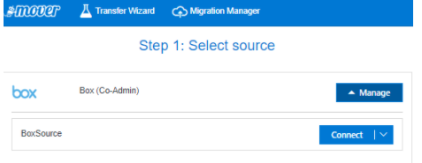
 
An icon appears and displays how many possible users are available for migrating.

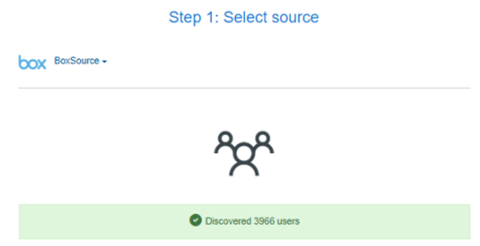
 
### Destination users

Do the same action for connecting to your Office 365 destination Connector.

1. Select **Destination** > **Manage** > **Connect**.

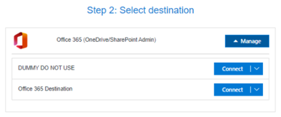
  

An icon appears and displays how many possible users are available for migrating.
 
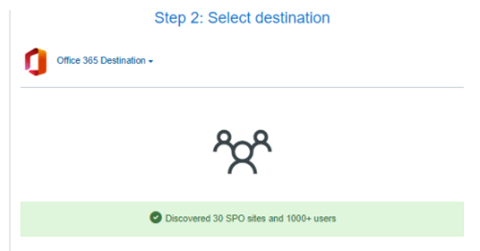

You will now want to create the Migration.

1. Select **Continue Migration Setup**.

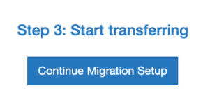
  
2. Create a user list of those transferring. Select **Add Users** .
3. Select  **Auto Discover Users** and the app will automatically find your users and attempt to match them up.
4. Once the Auto-Discover completes, Migration Manager will display the matching transfers for users between Source and Destination. 

If any of your Destination users do not have a match and their destination path column is blank, a scan will not be able to run. To correct this, download the Migration Report and create a new CSV file to upload containing no blank entries. 

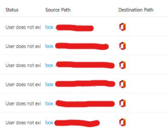
 
To download the report:

1. In **Migration Manager** select  **Migration Actions > Migration Report**.  This downloads the Migration Report as a CSV file to your downloads folder.  Open this CSV file.
2. Copy the three columns entitled **Schedule ID, Source and Destination**.
3. Open a new blank Excel worksheet.
4. Paste the **Schedule ID, Source and Destination** columns from Step 2 into columns A, B and C of the blank worksheet.
5. Rename the headings to ID, Source Path and Destination Path.
6. Filter on the blanks within column C (Destination Path).  
7. In the blank cells type, "No matching user". Clear the filter from “Destination Path”.

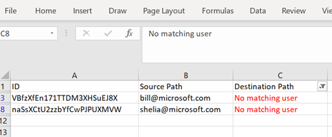

8. Save your Excel sheet as a CSV file.
9. Return to the Mover app and select **Migration Manager > Migration Actions > Update Migration**.
10. Select **Choose a File to Upload** to upload the updated CSV File.

Once the file is uploaded verify that any transfers that had a blank for the Destination Path are now populated with the value "No matching user".  You now will be able to run the scan.

## Running the Scan

It is best practice to start one Scan to ensure that both connectors are active and that the Scan runs successfully.

1. To start one scan, log into the tool, then select **Migration Manager**.  
2. Select the check box beside the first transfer and then select **Start Scan**.

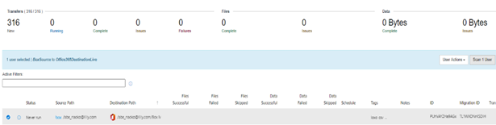
 
The transfer will turn from white to blue and the Status column changes to **Queued to Scanning.**  The columns for Files Skipped and Data Skipped should increase in number and size.  This indicates that the Scan for this transfer is running successfully.

While running a scan you should expect to see the following status types:

|Scan status type|Comment|
|:-----|:-----|
|Failed	|This status means that the Scan has failed on the Source user and should be scanned again and if it continues to fail, investigation is required.|
|Never Run|This status means the Scan has not yet been run.|
|Scanning|This status means the Scan is currently running.|
|Some Problems|This status means that the Scan completed but encountered some possible errors on the Source and should be scanned again and if it continues to report Some Problems investigation is required.|
|Success|This status means the Scan has successfully completed.|
|Queued|This status means the Scan is currently queued and will switch to Scanning status once the transfer is picked up on the queue.|

Once the scan completes, the majority of your transfers should turn green (see the examples below).

If some entries for users' files and data are blank, this usually indicates that the user owns 0 files or data. After the first scan finishes successfully, we recommend selecting just the next five users and run a scan against those. If that scan also returns green, then select all users and then click **Scan Users** to queue all other users.

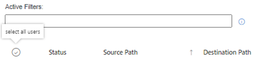
 

It may take time for all users to change from the *Never Run* status to either *Scanning* or *Queued*.

If the Scan you are doing exceeds 5,000 users, contact Microsoft Customer Engineering via email prior to starting the large Scan. We will make the Mover Infrastructure team aware that a large scan is starting.

>[Note]
>The length of time for a scan to run depends on how many users, how many files, how much data and how well distributed the customers' data is.  A large scan of over 100TB can take a few days to complete.

During the time the scan is running, send a daily email update to your key stakeholders to provide a snapshot of how the scan is progressing.  Take a screenshot of the dashboard within the Migration Manager to capture progress.

## Scan Reports

The scan results and the corresponding scan report are essential in aiding you in planning your migration.  They provide useful stats in determining the following:

- How many users own files/data?
- How many users own over 400,000 files?
- ow many users are without a matching Destination account?
- How many users failed to Scan?
- How many users currently have files/folders that exceed 400 characters in length in their Source?

To download the Scan Results sign into the Mover tool, go to Migration Manager, and select **Migration Actions > Scan Reports** (zip file). The download will be a zip file titled **ScanReport-[date]**.

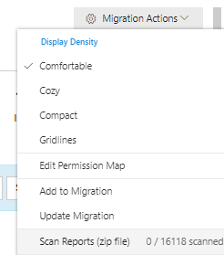

The zip file contains the following reports:

|Report|Description|
|:-----|:-----|
|**CommonPathReport**|This report provides a list of suggested path locations in the directory structure where to move any files/folders that exceed the Office 365 400-character limit as reported in the LongPathReport. These are suggested locations that if a customer were to move the long path file/folders to this location then the character length would be below the 400-character limit and the tool can then migrate the content.|
|**FilesExtensionReport**|This report provides a list all file extension types that exist in the Source tenant and the total amount of data for each file extension type.|
|**LargeFilesReport**|This report provides a list of any files that exceed the 15GB filesize limit that tools current API supports.  Any files over this limit will not be migrated via the tool. Though Microsoft is now supporting 100GB file limits, the current tool API does not.  This will be deployed in due course but at present <15GB is the largest filesize that the tool can migrate.|
|**LongPathReport**|This report provides a list of any files and/or folders that currently exceed the 400-character length limit within Office 365. If a customer does not remediate these long path files/folders then the tool will not be able to migrate the files or folder contents.  As noted above, we provide the CommonPathReport to aid customers in finding suitable locations to move the content to, that will ensure that it can be migrated.|
|**ScanSummaryReport**|This report provides the full list of all users scanned within the Source tenant and captures how many files they own, how much data they own and provides details on the status of each scanned transfer.Though these are all important reports for Managed Migration purposes the three key reports we focus upon are the CommonPathReport, LongPathReport and ScanSummaryReport.|

When managing a large migration, it is useful to create a custom report (manually) to work from with your users and stakeholders. 

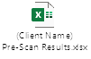

Once you open the Pre-Scan Results file you will see four tabs.

Pre-Scan Results
Permission Mapping
Transfers with Long Path Issues
Long Path Reduction Suggestions

Below we will discuss how to populate the Pre-Scan Results tabs to provide all the necessary information from the Scan to your customers.
•	Pre-Scan Results

When you open the Pre-Scan Results Excel sheet you will see it is populated with the following columns/information.

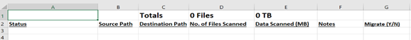 

In order to populate these columns we will take the data from the ScanSummaryReport file that was generated in the zip file.  

Open the ScanSummaryReport file and then copy the following columns into the [Client Name] Pre-Scan Results sheet.

|ScanSummaryReport Columns|Pre-Scan Results Columns|
|:-----|:-----|
|Status|Status|
|Source path|Source path|
|Files|Number of files scanned|
|Data (MB)|Data scanned (MB)|

Your [Client Name] Pre-Scan Results could look something like the below example.

 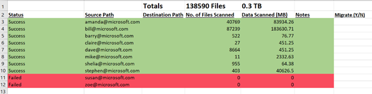

You will notice the Totals cells for Files and TB are automatically calculated and this provides the total number of files and data scanned for the Source tenant.

As a matter of practice, we prefer to organise the Scan Results by Status, showing the Failed transfers at the top of the Report. 

To do so, highlight all the cells from Column A/Line 2 to Column F/Last Line number (in this example that would be Line 12)

Right click in the highlighted are and then select Sort > Sort A to Z

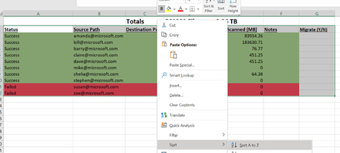 

This will bring the Failed scans to the top of the list and all other subsequent scans should report as Success.

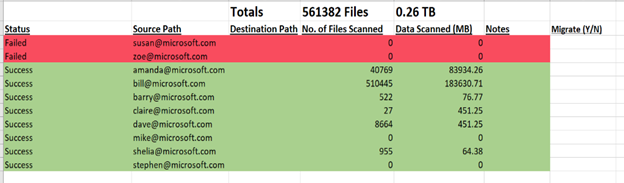

You will notice that the Destination Path column is currently blank.  At present the ScanSummayReport does not include the details of the Destination Path.  This issue is currently being addressed and future iterations of the ScanSummaryReport will include these details.

As you may recall earlier in the process we used Auto-Discover for mapping our Source and Destination users
This process allowed us to map the matching users between our Source and Destination connectors.

Since we used this process, we can then use that information to populate the Destination Path column on the Pre-Scan Report.

To obtain this information we will want to log into the customers account, then click Migration Manager > Migration Actions > Migration Report.

This will download the Migration Report and from this report we will want to copy Columns B (Source) and C (Destination) and Paste those into Columns 
B (Source Path) and C (Destination Path) on the Pre-Scan Results report.

We copy Columns B and C from the Migration Report to ensure that these columns accurately match and map correctly.

Your Pre-Scan Report should now look like the below example.
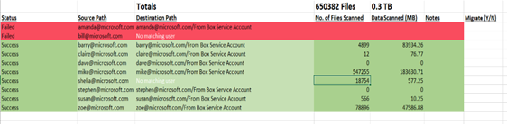
 
In the Destination Path column, you will see that all users with a matching Destination account end with /From BoxServiceAccount.

This is by design and this appending to the Destination transfers occurs during Auto-Discovery. 

As when we are migrating into Office 365 Destinations, ALL transfers should have a specific folder in which to migrate the data into.  This is true for both OneDrive and SharePoint transfers and it is something that we agree with the customer before starting the migration.

Some other items of note for completing the Pre-Scan tab are as follow:

|Issue|Action|
|:-----|:-----| 
|Failed scans|Download and review the Migration Error Report. The most common reasons for failed users is either  "cannot be found” or  "account has been deactivated”. Copy the error messages those against the corresponding Failed Users in the Notes column on the Pre-Scan Results.|
|Users with greater than 400,000 files|For any of these users, add a comment of “Large file/data owner” in the notes column. Any user with such a large amount of items needs to be reviewed for c splitting up their data into multiple services accounts before migration.| 
|Users with greater than 5TB of data|For any of these users, add a comment of “Large file/data owner” in the notes column. AAny user with such a large amount of items needs to be reviewed for c splitting up their data into multiple services accounts before migration.|
|Users who own 0 files|For any of these users, add a comment of “Users owns 0 files/data” in the notes column. Users who own 0 files can usually be excluded from the main migration as it adds extra time and resources to a migration, especially if there are 100s or 1000s of 0 files/data transfers.|
|Migrate (Y/N)|This column is for the customer to mark who they would like to include in the migration. This does not have to specifically be Y or N as you may be migrating some users in pilot test for the migration vs the main migration.| 

Establish a naming convention for who to migrate, such as shown here:

Here is an example of how the comments should look in the Pre-Scan results tab:

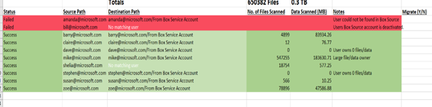