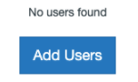
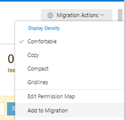
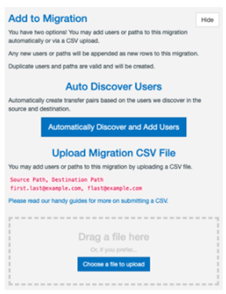
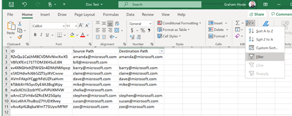
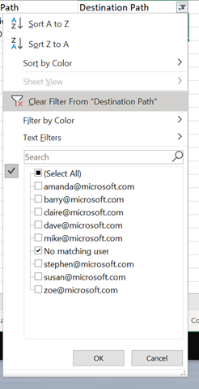
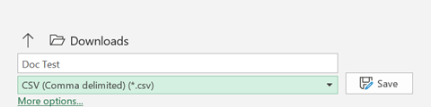

# Using the Scan feature in the Mover migration app

After you create and autorized your source and destination connectors using Mover, the next step is to run an inventory scan of your content.

## Scanning Source Users

This scan of the source tenant will determine how many users you have, how many files, and how much data that each user owns. This scan will also report any user that cannot be accessed on the source connector.

For your Source connector, within the tool you will want to select Transfer Wizard, 
1. Select source and then select the Manage button and then click Connect.

 
An icon appears and this displays how many possible users are available for migrating.

 
You will know want to perform the same actions for connecting to your Office 365 Destination Connector.

On Step 2: Select destination and then select the Manage button and then click Connect.

  

An icon appears and this displays how many possible users are available for migrating.
 

You will now want to create the Migration.

Select Continue Migration Setup, and our app moves to the Migration Manager.

  
The next step creates a user list of those transferring.
From your newly created migration in the Migration Manager, there are two ways to add users:
Select Add Users.

 
Or, select Migration Actions, and then select Add to Migration.

 
 
Select one of two options:
Auto Discover Users.
1.	Select Automatically Discover and Add Users, and the tool automatically finds your users and attempts to match them up.
 
2.	 Upload Migration CSV File.
Either drag a file into the designated space, or select Choose a file to upload, and add a customized CSV file for your migration.

For the purpose of Scanning it is recommended to use option 1, as this ensures we discover all the users in the Source tenant for scanning. 

The customer may not want/need all users scanned in the Source and if that is the case then we recommend using option 2 and asking the customer to supply a CSV file for those specific users.

Once the Auto-Discover completes, you should see the Migration Manager becomes populated with the relevant number of matching transfers for users between Source and Destination.

From the Auto-Discovery you may notice that some of your Destination users do not have a match and their entry under the Destination Path column is blank.  

A Scan will not be able to run if either the Source Path or Destination path is empty.

In order for you to run the Scan you will need to fill in those blanks. The best way to do so is to download the Migration Report and create a new CSV file to upload containing no blank entries. 

 
To achieve this please apply the following steps.
In the Migration Manager click on Migration Actions > Migration Report.
This will now download the Migration Report as a CSV file to your Downloads folder.  Open this CSV file.
From the downloaded Migration Report, copy the three columns entitled Schedule ID, Source and Destination
You will next want to open a blank Excel sheet. Open Excel and select File > New > Blank workbook.
In this new Excel workbook copy the Schedule ID, Source and Destination columns from Step 3 into columns A, B and C on the blank workbook.
Rename the headings to ID, Source Path and Destination Path.
You will now want to filter on the blanks within column C (Destination Path).  To do so highlight all of column C, then click Home >Filter Icon > Filter.

 

Click on the dropdown Filter arrow and then uncheck all by clicking the (Select All) button and then check (Blanks) > OK.  This will filter only the blank entries in the Destination column.

In the blank cells input No matching user and then click on the Filter arrow again and then select Clear Filter from “Destination Path”.

 

 

Once you have filled in the blank cells then save your Excel sheet as a CSV file.  To do so, click File > Save As and from the dropdown menu select CSV (Comma delimited) (*.csv) and click Save.

Now return to the tool and select Migration Manager > Migration Actions > Update Migration.

Next either drag or drop or Choose a File to Upload to upload the updated CSV File.

Once the file is uploaded you should now notice that any transfers that had a blank for the Destination Path are now populated with No matching user.  You should now be able to start running the scan for the customer.

Running the Scan

When running a scan, it is best to follow some simple steps.  

Before starting all the transfers for a Scan, it is best practice to start one Scan to ensure that both connectors are active and that the Scan runs successfully.

In order to start one Scan, log into the tool, click on the Migration Manager.  Select the check box beside the first transfer and then click Start Scan.

 
The transfer will turn from white to blue and the Status column should change from Never run to Queued to Scanning.  

You should start seeing the columns for Files Skipped and Data Skipped increasing in number and size.  This indicates that the Scan for this transfer is running successfully.

While running a Scan you should expect to see the following Status types

 Scan Status Type	Comment
Failed	This status means that the Scan has failed on the Source user and should be scanned again and if it continues to fail, investigation is required.
Never Run	This status means the Scan has not yet been run.
Scanning	This status means the Scan is currently running.
Some Problems	This status means that the Scan completed but encountered some possible errors on the Source and should be scanned again and if it continues to report Some Problems investigation is required.
Success	This status means the Scan has successfully completed.
Queued	This status means the Scan is currently queued and will switch to Scanning status once the transfer is picked up on the queue.

Once the Scan completes the majority of your transfers should turn green (see the examples below).

As you will see in the above example, some of the entries for users' files and data are blank.  This usually indicates that this user owns 0 files or data, and these types of users will be discussed in the next section of the document (Planning Migration with Customers).

After the first Scan finishes successfully then it is usually best practice to select the next five users and run a Scan against those.

If these return green, then you can click on the select all users radio button just below the Active Filters box and then click Scan Users to queue all other users in this Migration.

 

It may take some time for all users to change from the Never Run status to either Scanning or Queued.

If the Scan you are doing exceeds 5,000 users, then it is common courtesy to reach out to Customer Engineering via email prior to starting the large Scan (joshua.badach@microsoft.com and/or grhosie@microsoft.com).  We will in turn make the Mover Infrastructure team aware that a large scan is starting.

The length of time for a Scan will all depend on how many users, how many files, how much data and how well distributed the customers' data is.  A large scan of over 100TB can take a few days to complete.

During the time the Scan is running, it is expected that you provide a daily email update to your customer(s) to provide a snapshot of how the Scan is progressing.

Usually we take a screenshot of the dashboard within the Migration Manager to capture progress.

Upon the Scans completion we then provide the customer with their Scan Report and we will discuss this in greater detail in the next section.

## Scan Reports

The scan results and the corresponding scan report are essential in aiding you in planning your migration with your customers.  They provide useful stats in determining the following:

- How many users own files/data?
- How many users own over 400,000 files?
- ow many users are without a matching Destination account?
- How many users failed to Scan?
- How many users currently have files/folders that exceed 400 characters in length in their Source?

To obtain the Scan Results you want to be log into the customers account on the tool and under Migration Manager select Migration Actions > Scan Reports (zip file).

 
•	
This will then download a ScanReport-[date] zipped file to your Downloads.

Within this zip file you will find the following reports:

CommonPathReport - This report provides a list of suggested path locations in the directory structure where to move any files/folders that exceed the Office 365 400-character limit as reported in the LongPathReport.

These are suggested locations that if a customer were to move the long path file/folders to this location then the character length would be below the 400-character limit and the tool can then migrate the content.

FilesExtensionReport - This report provides a list all file extension types that exist in the Source tenant and the total amount of data for each file extension type.

LargeFilesReport - This report provides a list of any files that exceed the 15GB filesize limit that tools current API supports.  Any files over this limit will not be migrated via the tool.

Though Microsoft is now supporting 100GB file limits, the current tool API does not.  This will be deployed in due course but at present <15GB is the largest filesize that the tool can migrate.

LongPathReport – This report provides a list of any files and/or folders that currently exceed the 400-character length limit within Office 365.

If a customer does not remediate these long path files/folders then the tool will not be able to migrate the files or folder contents.  As noted above, we provide the CommonPathReport to aid customers in finding suitable locations to move the content to, that will ensure that it can be migrated.

ScanSummaryReport – This report provides the full list of all users scanned within the Source tenant and captures how many files they own, how much data they own and provides details on the status of each scanned transfer.

Though these are all important reports for Managed Migration purposes the three key reports we focus upon are the CommonPathReport, LongPathReport and ScanSummaryReport.

These reports within the zip file contain enough information for customers to understand their scan but when conducting a Managed Migration we like to provide the customer with a report more tailored and presentable for them to work from.

We provide the customer with a specific Excel file which we manually create on their behalf.

At present, we use the attached Excel template for the Scan Report.

 

When using this template, we advise making a copy and changing the (Client Name) part to the specific customer you are working with.

Once you open the Pre-Scan Results file you will see four tabs.

Pre-Scan Results
Permission Mapping
Transfers with Long Path Issues
Long Path Reduction Suggestions

Below we will discuss how to populate the Pre-Scan Results tabs to provide all the necessary information from the Scan to your customers.
•	Pre-Scan Results

When you open the Pre-Scan Results Excel sheet you will see it is populated with the following columns/information.

 

In order to populate these columns we will take the data from the ScanSummaryReport file that was generated in the zip file.  

Open the ScanSummaryReport file and then copy the following columns into the [Client Name] Pre-Scan Results sheet.

ScanSummaryReport Columns	Pre-Scan Results Columns
Status	Status
Source Path	Source Path
Files	No. Of Files Scanned
Data (MB)	Data Scanned (MB)

Your [Client Name] Pre-Scan Results could look something like the below example.

 

You will notice the Totals cells for Files and TB are automatically calculated and this provides the total number of files and data scanned for the Source tenant.

As a matter of practice, we prefer to organise the Scan Results by Status, showing the Failed transfers at the top of the Report. 

To do so, highlight all the cells from Column A/Line 2 to Column F/Last Line number (in this example that would be Line 12)

Right click in the highlighted are and then select Sort > Sort A to Z

 

This will bring the Failed scans to the top of the list and all other subsequent scans should report as Success.

You will notice that the Destination Path column is currently blank.  At present the ScanSummayReport does not include the details of the Destination Path.  This issue is currently being addressed and future iterations of the ScanSummaryReport will include these details.

As you may recall earlier in the process we used Auto-Discover for mapping our Source and Destination users
This process allowed us to map the matching users between our Source and Destination connectors.

Since we used this process, we can then use that information to populate the Destination Path column on the Pre-Scan Report.

To obtain this information we will want to log into the customers account, then click Migration Manager > Migration Actions > Migration Report.

This will download the Migration Report and from this report we will want to copy Columns B (Source) and C (Destination) and Paste those into Columns 
B (Source Path) and C (Destination Path) on the Pre-Scan Results report.

We copy Columns B and C from the Migration Report to ensure that these columns accurately match and map correctly.

Your Pre-Scan Report should now look like the below example.

 
In the Destination Path column, you will see that all users with a matching Destination account end with /From BoxServiceAccount.

This is by design and this appending to the Destination transfers occurs during Auto-Discovery. 

As when we are migrating into Office 365 Destinations, ALL transfers should have a specific folder in which to migrate the data into.  This is true for both OneDrive and SharePoint transfers and it is something that we agree with the customer before starting the migration.

The reasons behind why this is an essential practice for Migrations will be discussed in the Planning Migrations with Customers section.

Some other items of note for completing the Pre-Scan tab are as follow:

Failed Scans - If you encounter these types of scans then we should provide the customer with the reason for said failures.  To obtain this information we want to review the Migration Error Report.  This can be garnered by logging into the tool, Migration Manager > Migration Actions > Migration Error Report.

This will download the Migration Error Report as a csv, open this file and then locate any failed users from the Scan.  Within this report you will be able to find the reason for failure under the Error Message column.

The most common causes for Failed users on a Scan are that the user” cannot be found” or the ”account has been deactivated”.  

Once you have the Error Messages from the Migration Error Report then copy those against the corresponding Failed User in the Notes Column on the Pre-Scan Results.

Users with files > 400,000 – For any user that own more than 400,000 items then you should add a comment of “Large file/data owner” in the Notes column for those users.  

Any user with such a large amount of items should be brought to the customers' attention and potentially could be a candidate for splitting up their data into multiple services accounts for the Migration.

The reasons why we want to consider splitting up large file owners will be discussed in the Planning Migrations with Customers section.

Users with data > 5TB - For any user that own more than 5TB of data then you should add a comment of “Large file/data owner” in the Notes column for those users.  

Any user with such a large amount of data should be brought to the customers' attention and potentially could be a candidate for splitting up their data into multiple services accounts for the Migration.

The reasons why we want to consider splitting up large data owners will be discussed in the Planning Migrations with Customers.

Users who own 0 files/data - For any user that owns 0 files/data then you should add a comment of “Users owns 0 files/data” in the Notes column for those users.  

Users who own 0 files can usually be excluded from the Main Migration, as when running a 0 files/data transfer we will not be migrating any data for that user and it adds extra time and resources to a Migration if we are potentially running 100s or 1000s of 0 files/data transfers.

Migrate (Y/N) - The Migrate (Y/N) column is for the customer to mark who they would like to include in the Migration.  This does not have to specifically be Y or N as you may be migrating some users in Pilot test for the Migration vs the Main Migration.  

Discussing the naming convention for who to migrate can be established with communication with the custome.

An example of how these comments should look in the Pre-Scan Results tab is provided below.

