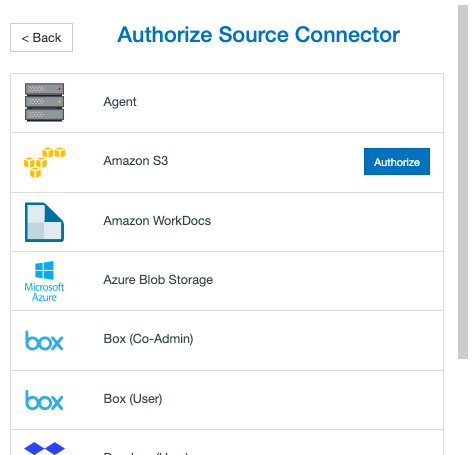
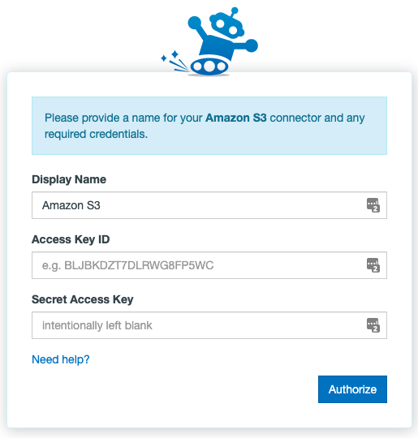

#  Setting up migration from Amazon S3 using Mover

## Authorizing Amazon S3

Authorizing Amazon S3 is straightforward. To authorize or add a Amazon S3 account as a Connector, follow these simple steps:

1. In the Transfer Wizard click Authorize New Connector.


2. Find Amazon S3 in the Connector list.
3. Click **Authorize.**



4. A new window (tab) will open. Name your Connector (Optional).
5. Enter your Access Key ID and Secret Access Key.



6. Click **Authorize** again.

## Troubleshooting an Amazon S3 Connector

**Authorization:** If you're having trouble creating or adding a Amazon S3 connector, here are some things to try:

- Double check that you're entering in your Access Key ID and Secret Key correctly - these are both long alphanumeric strings prone to mistakes if entered manually. If copy and pasting, ensure that your computer is accurately performing that task.
- Hover over your existing Amazon S3 integration in the Connector selection screen and select Reauthorize. This will take you through the Connector creation steps again in order to refresh the token/permissions that we have with your Amazon S3 account.
- Open up private browsing or incognito mode and try again.

**Transfer from Amazon S3 source:** If you're having trouble transferring from Amazon S3:

- Select your finished transfer and click Start Migrating on the top right of the Migration Manager to rerun the the transfer.
- View your most recent transfer log by selecting the transfer and clicking View Log from the User Actions dropdown menu and see if there are any particular error messages you could act on.

**Transfer to Amazon S3 destination:** If you're having trouble transferring into Amazon S3:

- Select your finished transfer and click Start Migrating on the top right of the Migration Manager to rerun the the transfer.
- View your most recent transfer log by selecting the transfer and clicking View Log from the User Actions dropdown menu and see if there are any particular error messages you could act on.
- Amazon S3 Regions: We now support all S3 regions with Signature Version 4.

**Using Amazon S3 via IAM:** With Amazon S3, by default we should have no trouble accessing your buckets. Here's how to connect to S3 via IAM:

- From the AWS dashboard, go to the Services menu, then Administration & Security, and then IAM.
- Then you'll want to create a user if you haven't already.
- Next you'll need to go into Policies and hit Create Policy, and then pressCreate Your Own Policy so we can make a custom policy.
- Name this policy something you'll easily find - perhaps Example+IAM or something along those lines - you can also include a description of what it is. You'll then need to copy and paste the following into the Policy Document field:

```json
{
  "Version": "2012-10-17",
  "Statement": [

    {
      "Effect": "Allow",
      "Action": "s3:ListAllMyBuckets",
      "Resource": "*"
    },
    {
      "Effect": "Allow",
      "Action": "s3:*",
      "Resource": "arn:aws:s3:::MyBucket"

    },
    {
      "Effect": "Allow",
      "Action": "s3:*",

      "Resource": "arn:aws:s3:::MyBucket/*"
    }
  ]
}
```

- You'll need to go back to the Users menu, click on the user you'd like to add the policy to, and then press Attach Policy. From here, you can search for the custom policy you've created, select it, and then hit the Attach Policy button at the bottom right of the screen.
