# Setting up your migration from Box to Office 365

## Box FAQ

### Should we disable our Box accounts?
Disabling employee access to their Box accounts mitigates any risk of them accessing data after the migration takes place.

This practice:

1. Keeps their Box accounts for a few weeks before deleting them.
2. Keeps their Box data available in read-only format.

Think of your employees' needs and what works best for the team.

### What happens to Box Notes?

Our app does not currently support Box Notes conversion.

### Locked files

We automatically unlock locked Box files and download them.

The file(s) remain unlocked after this process, so if you want to re-lock the files, you must do so from Box directly.

### Disable email notifications

In Box, there are settings to notify users when downloads occur for content they own. This can equate to spam during a migration because our app downloads all their files.

When logged in as a Box admin, disable this setting from:  https://app.box.com/master/settings/notification

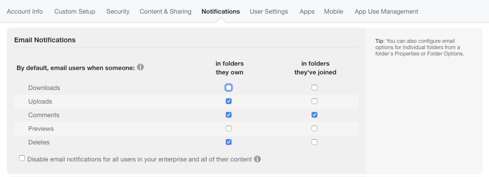

### Box data reporting

We've found that Box occasionally has hiccups with reporting storage quotas in their service. If you discover that there is a discrepancy between what we are reporting and what Box's dashboard and/or reporting informs you, you must contact their support team and ask them to refresh/recalculate the storage quotas on your account (frequently, you need to escalate this beyond their first-level support).

For more info about this issue, see **here** and **here**.

## Setting up the migration

### Authorizing Box (Co-Admin)

Authorizing Box as an Administrator or a Co-Administrator is straightforward. To authorize or add a Multi-User Box account as a connector, follow these simple steps:

1. Navigate to **[Add Mover as a Custom Application](https://app.box.com/master/custom-apps)**. 
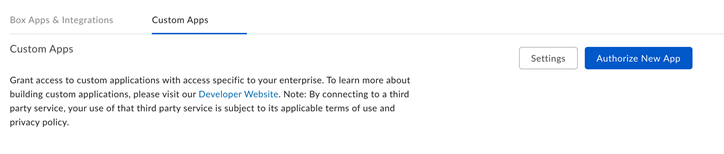
2. Select **Authorize New App**. 
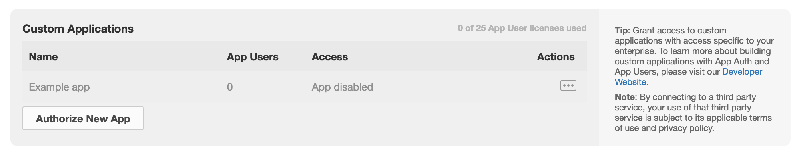
3. Enter the API Key: `7ypzdr66s3m80h3hutop34u7yml8928x`
4. Select **Next**.  
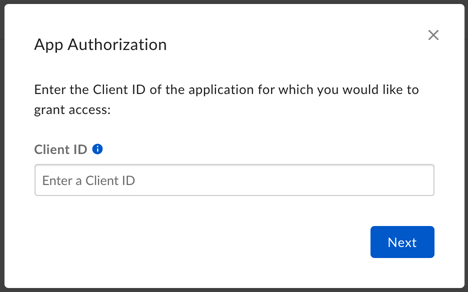  
5. In the new window, select **Authorize** to authorize our app.  
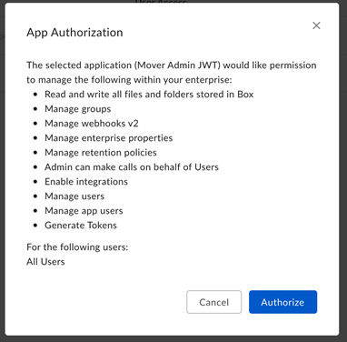  
6. In the Mover app, return to the **Transfer Wizard**, and select **Authorize New Connector**.  
  
7. In the **Connector** list, find **Box (Co-Admin)**.
8. Select **Authorize**. 
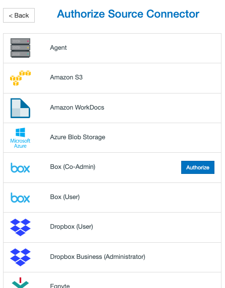  
    A new window (tab) opens.
9. Name your **Connector** <optional>.  
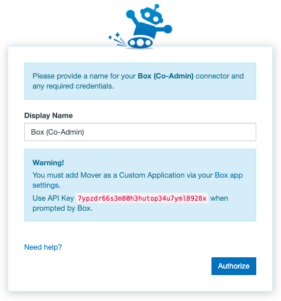  
10. Select **Authorize** again. 
11. If you are not logged in, to grant access, you can use either your Box credentials, or a SSO account.  
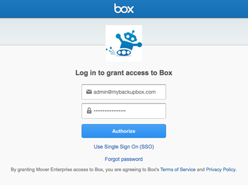  
12. To grant our app access to your Box account, select **Allow**.  
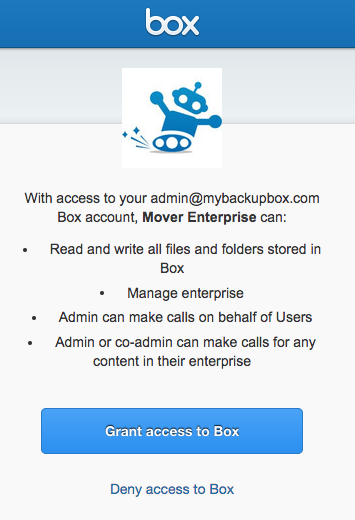  

You should now be connected to Box with Co-Admin authorization!

### Troubleshooting a Box (Co-Admin) connector

**App Permissions**: Your organization may default all apps to disabled. See the following quick guide about how to ensure our app is enabled.

1. Under **Enterprise Settings**, navigate to **Apps**. Here is a shortcut link: https://app.box.com/master/settings/apps   
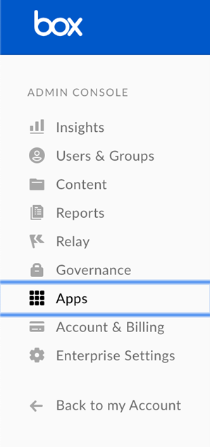  
2. In the **Recommended Apps** section, ensure "Enable for 3rd party apps that are Added by Default only" is checked.  
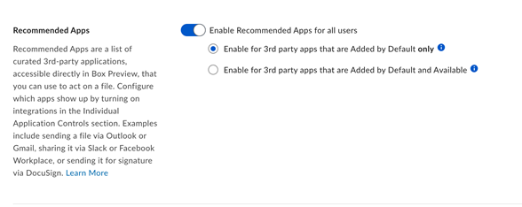  
3. Under **Individual Application Controls**, navigate to our app.
4. Select **Available**.  
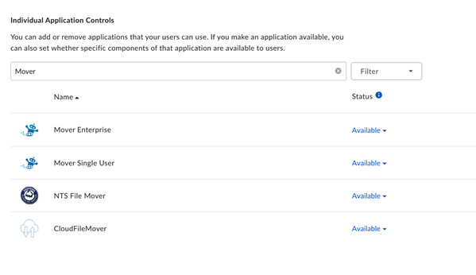  

#### Box permission requirements
For authorization, our app requires an **Administrator** or **Co-Administrator**. The following table lists the scopes we require:

|**Permission**|**(Details) Allows our app to...**|
|:-----|:-----|
|Read and write all files and folders stored in Box    |Read, create, update, and overwrite data in Box.|
|Manage Enterprise    |Manage any data found in the authorized Box directory.|
|Admin can make calls on behalf of Users    |Grants permission for our app to contact Box servers on behalf of users' accounts.|
|Admin or co-admin can make calls for any content in their enterprise    |Grants our app permission to contact Box servers on behalf of administrators or co-administrators regarding any data found in your business's Box directory.|

#### Removing app access
Deleting or disabling the account used to Authorize Box (Co-Admin) does not remove our app's access to Box.

To remove our app's access to Box:

1. On the **Box Admin Console**, under **Enterprise Settings**, navigate to the **Apps** panel.
- Scroll down to **Custom Applications**.
- Select **...**, and in the dropdown menu, select **Disable app authorization**.

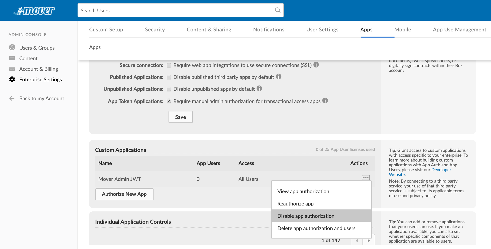

>[!Note]
>To delete a custom app, you must contact Box.