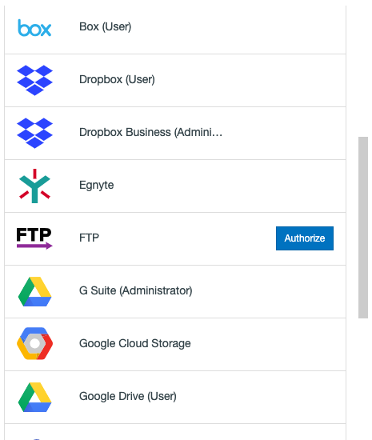
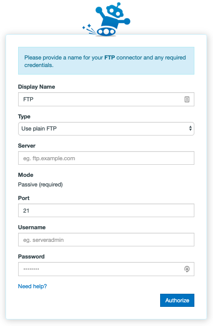

FTP
Authorizing FTP
Authorizing FTP is a fairly simple process - despite being a very old protocol, many web applications still use it. This means you can connect to some web apps we don't formally have Connectors for via this method!

You can also connect to a regular FTP server using the app. To authorize or add an FTP server as a Connector, follow these simple steps:

IMPORTANT! You will need to make sure our IP address is whitelisted on your FTP server. The IP address we use for FTP transfers is:

104.198.169.166
Then:

1. In the Transfer Wizard click Authorize New Connector.

2. Find FTP in the Connector list.
3. Click **Authorize**.

4. A New window (tab) will open. Enter your credentials as follows:

- **Display Name:** Your connector's nickname - this can be anything to help distinguish it from other connectors.
- **Type:** The type of FTP server you are connecting to. In most cases this will be Plain FTP.
- **Server:** The URL that points at the FTP server you would like to connect to. Generally this will be the domain of your website with a prefixed “ftp.” Example: “ftp.yourwebsite.com”. You are also able to use your external IP address in place of the URL.
- **Port:** The server port FTP connections run through. This is almost always port 21.
- **Username:** The username you have created, or been provided with, in order to log into your FTP server.
- **Password:** The password you have created, or been provided with, in order to log into your FTP server.

5. Click **Authorize**.

## Troubleshooting FTP

**Authorization:** If you're having trouble creating or adding an FTP connector, here are some things to try:

- Verify that your FTP credentials are indeed correct and working. We recommend http://ftptest.net - if it works there, it'll work in the app!
- Make sure your FTP server is set to allow 'Passive' connections. We can not access servers using 'Active' connections.
- Hover over your existing FTP integration in the Connector selection screen and select Reauthorize. This will take you through the Connector creation steps again in order to refresh the permissions that we have with your FTP server.
- Open up private browsing or incognito mode and try again.
- Be patient - sending too many connection requests in a short period of time can cause your FTP server to temporarily reject us.
- Some FTP servers may have restrictive rules put in place that might not play nice with our app - in some cases, you can alleviate this by connecting via our SFTP connector instead (where allowed).

**Whitelisting:** If you are having trouble connecting, please ensure that our IP address is not being blocked by your host/server. The IP address you need to allow is:

- 104.198.169.166

**Blacklisting:** If you are not in direct control of your FTP server or are using a special or hosted FTP server software, you may need to manually remove our IP address from the blacklist or ask the hosting provider or administrator to do this for you.

**Port:** Please ensure that the appropriate port is open on your network as this is a requirement - i.e. if you selected Port 21 for the app to connect to your FTP server, then this port needs to be open.

**FTPS (FTP over TLS):** When adding an FTP connector, switch from Use plain FTP to either Require explicit FTP over TLS or Require implicit FTP over TLS in the 'Type' field.

**Transfer from FTP source:**If you're having trouble transferring from FTP:

- elect your finished transfer and click Start Migrating on the top right of the Migration Manager to rerun the the transfer.
- View your most recent transfer log by selecting the transfer and clicking View Log from the User Actions dropdown menu and see if there are any particular error messages you could act on.
- Are you transferring large files? Files larger than a few gigabytes in size take a particularly long time to download from an FTP server, which means there's a greater chance they could timeout and fail.

**Transfer to FTP destination:** If you're having trouble transferring into FTP:

- Select your finished transfer and click Start Migrating on the top right of the Migration Manager to rerun the the transfer.
- View your most recent transfer log by selecting the transfer and clicking View Log from the User Actions dropdown menu and see if there are any particular error messages you could act on.
- Are you transferring large files? Files larger than a few gigabytes in size take a particularly long time to upload to an FTP server, which means there's a greater chance they could timeout and fail.
