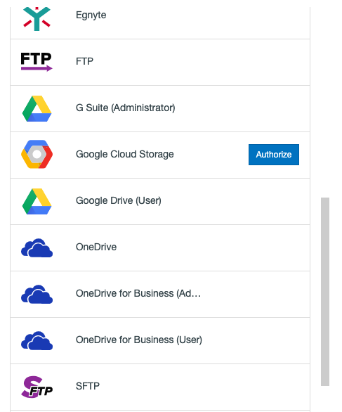
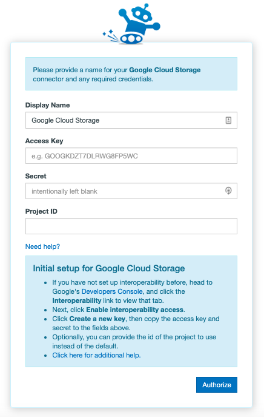

#  Setting up your Google Cloud Storage migration to Office 365

## Authorizing Google cloud storage

Authorizing Google Cloud Storage is straightforward. To authorize or add a Google Cloud Storage account as a Connector, follow these simple steps:

- First, you'll need to log in to your Google Cloud Platform Dashboard/Console.
- From there, go to Storage and then Settings and Interoperability. From here, you can see your storage buckets, and which one is set to default.
- Click on Create a new key. These are the credentials you'll use in the app in the next steps.

Enabling Interoperability in Google Cloud

1. In the Transfer Wizard click **Authorize New Connector**.

2. Find Google Cloud Storage in the Connector list.
3. Click **Authorize**.

4. A new window (tab) will open. Name your Connector (Optional).
5. Enter your Access Key & Secret Key (which you created in the previous steps), as well as your Project ID (if different from the default).

6. Click Authorize again.

## Troubleshooting

**Google Cloud Nearline:** Once you've authorized a Google Cloud Storage Connector, you simply have to create a Nearline bucket the same way you would a regular storage bucket. [Click here to read more in Google's support docs](https://cloud.google.com/storage/docs/storage-classes#nearline).

