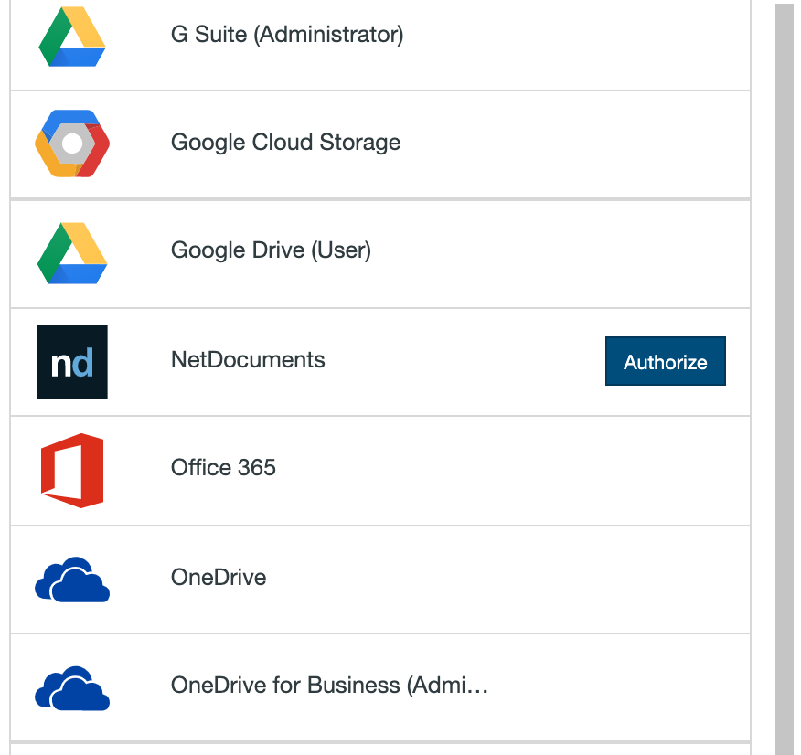
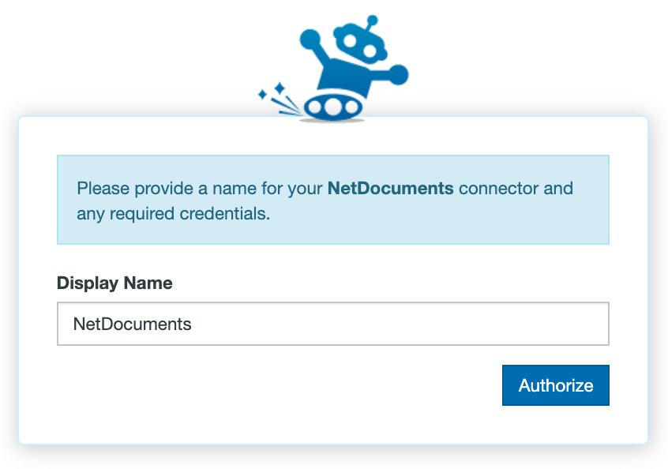
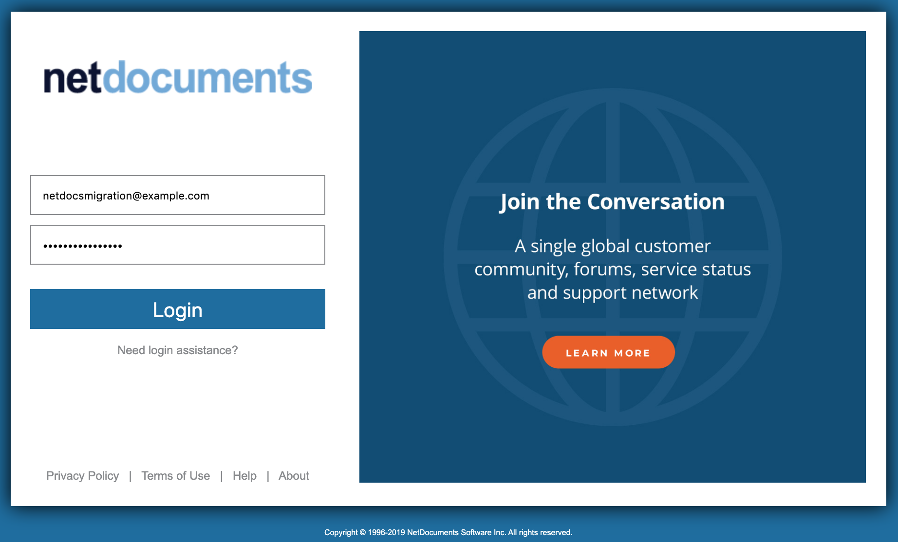

# Setting up your migration from NetDocuments

## Authorizing NetDocuments

Authorizing NetDocuments is straightforward. To authorize or add a NetDocuments account as a Connector, follow these simple steps:

1. In the Transfer Wizard click **Authorize New Connector**.

2. Find NetDocuments in the Connector list.
3. Click **Authorize.**

4. A new window (tab) will open. Name your Connector (Optional).

5. Click **Authorize** again.
6. Sign into NetDocuments and grant the App access to your account.

## Troubleshooting NetDocuments

**Authorization:** If you're having trouble creating or adding a NetDocuments connector, here are some things to try:

- Hover over your existing NetDocuments Connector in the Connector selection screen and select Reauthorize. This will take you through the Connector creation steps again in order to refresh the token/permissions that we have with your NetDocuments account.
- Open up private browsing or incognito mode and try again.

**Transfer from NetDocuments source:** If you're having trouble transferring from NetDocuments:

- Select your finished transfer and click Start Migrating on the top right of the Migration Manager to rerun the the transfer.
- View your most recent transfer log by selecting the transfer and clicking View Log from the User Actions dropdown menu and see if there are any particular error messages you could act on.

**Transfer to NetDocuments destination:** If you're having trouble transferring into NetDocuments:

- Select your finished transfer and click Start Migrating on the top right of the Migration Manager to rerun the the transfer.
- View your most recent transfer log by selecting the transfer and clicking View Log from the User Actions dropdown menu and see if there are any particular error messages you could act on.
