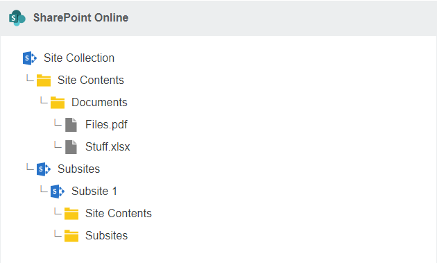

# Setting up migration from Microsoft 365 to Microsoft 365

## Before you begin:  Microsoft 365 FAQ

### Will there be unsupported files and characters?

Transferring from one Microsoft 365 tenant to another means the source and the destination have the same limitations; therefore, your data should meet the compatibility requirements when downloading data from Office 365 and uploading data into Microsoft 365.

### Character limits for files and folders

Filenames can have up to 256 characters.
Folder names may have up to 250 characters.
Total path length for folder and filename combinations can have up to 400 characters. For more info, see **below**.

### What happens to OneNote notebooks?

**OneNote notebooks** are viewed as folders in our app, with a table of contents (.onetoc2) file, and a file for each section (.one). These files are transferred to the destination, but will likely require reconfiguration in the destination.

### Are timestamps preserved?

The original timestamps from Office 365 are preserved when migrating to Microsoft 365.

>[!Note]
>Timestamps are only applied to files/data transfered, and not folders. Folders and folder structure are created in the destination during migration, and reflect the date of the migration.

### Is file authorship preserved?

When migrating to Microsoft 365 from Office 365, the *modified by* author is preserved. However, the *created by* is changed to the user.

### Does the Mover app interact with the sync client in OneDrive for Business?

We do not interact with the sync client in **OneDrive for Business**. Before a migration, We recommend disabling it. If you use it during a migration, it tries to sync all the migrating data.

### What happens to shared data?

Data shared with a user by another user appears in the **Shared with me** folder. Data owned by a user will appear in the user's designated destination folder.

### What about notifications?

To prevent users from being spammed, the Mover app silences notifications during the migration.

### What happens to data shared to Office 365 Groups?

Data shared to an Office 365 Group does not appear in the **Shared with me** section. Microsoft also does not notify users that they are now a member of an Office 365 Group.

>[!Note]
>This is a limitation of Office 365 Groups and cannot be changed on our end. The user must navigate to the appropriate group within either their Outlook Desktop Client, or by logging into their prefered email through **outlook.office.com**.

After the user has logged in:

1. Navigate to the left hand menu.
2. Scroll down the folder listings to **Groups**.
  a. If the available groups are not visible, to open the group directory, select the small arrow beside the **Groups** listing.
3. Select the desired group.
From here, the left-hand menu should change, enabling you to open and edit **Files/Notes** within the selected Office 365 Group.

### What SharePoint site formats are supported?

Both Modern and Classic sites are supported, and appear the same in our app.

### What will my file paths look like in SharePoint?

During the migration setup (described later in this guide), you can edit the path(s) to specify where in SharePoint you would like your data to go. From the root level of SharePoint Online, you can go into **Site Collections**, and inside each **Site Collection**, find directories for **Site Contents** and **Subsites**.

**Site Contents** takes you to document libraries (for example, the **Documents** section), whereas **Subsites** takes you to the **Subsites** of that site collection. Navigating **Subsites** takes you through the same dichotomy.

Most cloud storage providers, G Suite Drive for example, start the listing with a user such as `/user@example.com/Marketing Folder`. SharePoint Online does not do this, so you would be looking at a path such as `/Marketing/Site Contents/Documents`.

### How does library permissions inheritance affect migration?

To set specific permissions on folders in a document library, inheritance must be disabled. Permissions inheritance is typically turned on by default, which makes all the data within the library subject to the permissions set on the library. This is similar behavior to team folders or team drives in other cloud services, whereby if users have access to the root level, they have access to everything contained within.

If inheritance is not disabled at the root, any permissions we try to set on individual folders is overridden by the library access permissions.

**To disable inheritance:**

In the Library settings, visit **Permissions for this document library**:

1. Select **Stop Inheriting Permissions**.
  a. This enables you to select the permissions you would like to remove:
   - Site members
   - Site visitors
2. Select **Remove User Permissions**.

This prevents site members/visitors from inheriting permissions to all the data that we migrate into that library, allowing permissions to only those site members who we explicitly write to the folders themselves.

For more info about SharePoint Online permissions inheritance, see **here**.

### Does Mover support Microsoft Teams?

Microsoft Teams appears and operates the same as a SharePoint Online site.

### What is the item limit for SharePoint Online?

Many sites claim that SharePoint has a 5,000-item limit. This is not true. The SharePoint 5,000-item limit applies to how many items appear in a search list view: a maximum of 5,000.

SharePoint sites do have file size and number limits, which are covered in detail here: **SharePoint Online limits**.

Some list view options may prevent search list views with more than 5,000 items from appearing.

## Setting up the migration

### Authorizing Microsoft 365

>[!Warning]
>To fully authorize the **Microsoft 365 Connector**, a Global Admin is required to grant permissions to the Microsoft 365 Mover app within the Azure portal.
>
>The Global Admin must grant these permissions *after* the Microsoft 365 Connector is authorized within the main Mover app.

The following instructions show you how to complete the authorization steps in the right order.

Some steps in the authorization process can be completed by a Global Admin or an SPO Admin. At the beginning of each step, we indicate who can complete it.

1. **Global Admin or SPO Admin:** Log into the main Mover app via **app.mover.io**. In the **Transfer Wizard**, select **Authorize New Connector**.

>[!Note]
>Whether the **Microsoft 365 Connector** is your source or destination connector (or both), you'll need to go through this authorization process.

2. **Global Admin or SPO Admin**: In the **Connector** list, find **Microsoft 365**. Select **Authorize**.

3. **Global Admin or SPO Admin**: A window with an **Authorize** button appears. It prompts you to provide a display name <optional> for your **Microsoft 365 Connector**.  Select **Authorize**.

4. **Global Admin or SPO Admin**: Follow the on-screen instructions. You are redirected to a Microsoft login screen where you can log in with your Microsoft admin privileges and continue to authorize the connector.

>[!Warning]
>If you are a **Global Admin**, a slightly different login screen will display.  
>
>**DO NOT** select the option **Consent on behalf of your organization**. This option **must** remain unselected.

- 

5. **Global Admin or SPO Admin**: After authorizing the connector, you are redirected to the **Mover Transfer Wizard**, and see an error, like the following. This means it is now time for a Global Admin in your tenant to grant permissions to the Microsoft 365 Mover app in the Azure portal.

If you're an **SPO Admin**: To grant permissions and finish the authorization process (Steps 6–9), point your Global Admin to **aka.ms/office365moverauth**.

If you're a **Global Admin**: Continue with Steps 6–9.

6. **Global Admin**: Log into the Azure Portal via **aka.ms/office365moverauth**. You'll see a list of **Enterprise applications**.

7. **Global Admin**: Find and select the **Microsoft 365 Mover** app. A page appears that provides an overview of our app.

8. **Global Admin**: In the left menu, find and open **Permissions**. Select **Grant admin consent for Mover**.

9. **Global Admin**: A pop-up window appears that guides you through the rest of the permissions process. When complete, it closes automatically, and your **Microsoft 365 Connector** is fully authorized and ready to go.