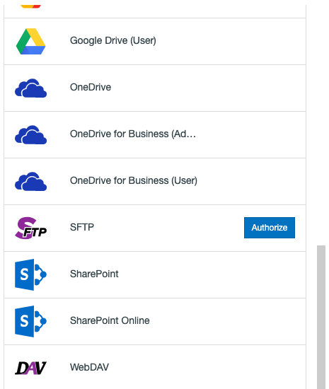
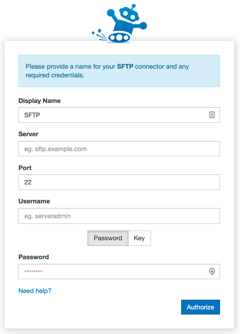

# Setting up SFTP migration

## Authorizing SFTP

Authorizing SFTP (also known as SSH) is a fairly simple process - despite being a very old protocol, many web applications still use it. This means you can connect to some web apps we don't formally have Connectors for via this method!

You can also connect to a regular SFTP server using our app. To authorize or add an SFTP server as a Connector, follow these simple steps:

>[!IMPORTANT]
> You will need to make sure our IP address is whitelisted on your SFTP server. The IP address our app uses for SFTP transfers is:
>
> - 104.198.169.166

Then:

1. In the Transfer Wizard click Authorize New Connector.

2. Find SFTP in the Connector list.
3. Click Authorize.

4. A New window (tab) will open. Enter your credentials as follows:

- Display Name: Your connector's nickname - this can be anything to help distinguish it from other connectors.
- Server: The URL that points at the SFTP server you would like to connect to. This will be the domain of your website, sometimes with a prefixed “sftp.” Example: “sftp.yourwebsite.com”. You are also able to use your external IP address in place of the URL.
- **Port:** The server port SFTP connections run through on your server.
- **Username:** The username you have created, or been provided with, in order to log into your SFTP server.
- **Password | Key:** You have the option to select between using a regular password or a pass key.
  - **Password:** The password you have created, or been provided with, in order to log into your SFTP server.
  - **Key:** You can copy and paste your secure access key into the text box.

5. Click **Authorize**.

## Troubleshooting SFTP

**Authorization:** If you're having trouble creating or adding an SFTP connector, here are some things to try:

- Hover over your existing SFTP integration in the Connector selection screen and select Reauthorize. This will take you through the Connector creation steps again in order to refresh the permissions that the app has with your SFTP server.
- Open up private browsing or incognito mode and try again.
- Be patient - sending too many connection requests in a short period of time can cause your SFTP server to temporarily reject our app.

**Whitelisting:** If you are having trouble connecting, please ensure that our IP address is not being blocked by your host/server. The IP address you need to allow is:
  - 104.198.169.166

**Blacklisting:** If you are not in direct control of your SFTP server or are using a special or hosted SFTP server software, you may need to manually remove our IP address from the blacklist or ask the hosting provider or administrator to do this for you.

**Port:** Please ensure that the appropriate port is open on your network as this is a requirement - i.e. if you selected Port 22 for our app to connect to your SFTP server, then this port needs to be open.

**PuTTY & PPK:** When using PuTTY to generate a PPK for your SFTP server, you will need to export your PPK to OpenSSH format. To do so, open your private key in PuTTYGen. Go to the top menu and select **Conversions** and then **Export OpenSSH key**. Save the new OpenSSH key when prompted.

**Transfer from SFTP source:** If you're having trouble transferring from SFTP:

- Select your finished transfer and click **Start Migrating** on the top right of the Migration Manager to rerun the the transfer.
- View your most recent transfer log by selecting the transfer and clicking View Log from the User Actions dropdown menu and see if there are any particular error messages you could act on.
- Are you transferring large files? Files larger than a few gigabytes in size take a particularly long time to download from an SFTP server, which means there's a greater chance they could timeout and fail.

**Transfer to SFTP destination:** If you're having trouble transferring into SFTP:

- Select your finished transfer and click **Start Migrating** on the top right of the Migration Manager to rerun the the transfer.
- View your most recent transfer log by selecting the transfer and clicking **View Log** from the **User Actions** dropdown menu and see if there are any particular error messages you could act on.
- Are you transferring large files? Files larger than a few gigabytes in size take a particularly long time to upload to an SFTP server, which means there's a greater chance they could timeout and fail.
