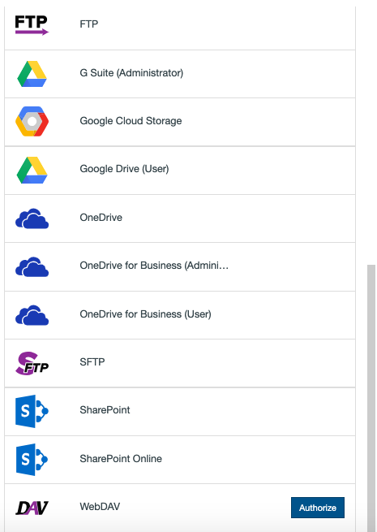
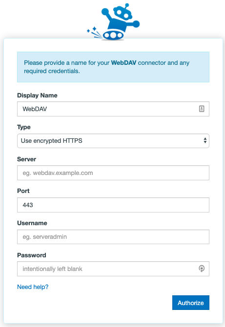

# Setting up migration of WebDAV

## Authorizing WebDAV

Authorizing WebDAV is a fairly simple process - despite being an older protocol, many web applications still use it. This means you can connect to some web apps we don't formally have Connectors for via this method.

You can also connect to a regular WebDAV server using our app. To authorize or add a WebDAV server as a Connector, follow these simple steps:

1. In the Transfer Wizard click Authorize New Connector.

2. Find **WebDAV** in the Connector list.
3. Click **Authorize.**

4. A New window (tab) will open. Enter your credentials as follows:

- Display Name: Your connector's nickname - this can be anything to help distinguish it from other connectors.
- Type: The type of WebDAV server you are connecting to in terms of encryption.
- Server: The URL that points at the WebDAV server you would like to connect to. You are also able to use the external IP address of that server in place of the URL.
- Port: The server port WebDAV connections run through. This is almost always port 443 by default.
- Username: The username you have created, or been provided with, in order to log into your WebDAV server.
- Password: The password you have created, or been provided with, in order to log into your WebDAV server.

5. Click Authorize.

## Troubleshooting WebDAV

**Authorization:** If you're having trouble creating or adding a WebDAV connector, here are some things to try:

- Verify that your WebDAV credentials are indeed correct and working.
- Hover over your existing WebDAV integration in the Connector selection screen and select Reauthorize. This will take you through the Connector creation steps again in order to refresh the permissions that our app has with your WebDAV server.
- Open up private browsing or incognito mode and try again.
- Be patient - sending too many connection requests in a short period of time can cause your WebDAV server to temporarily reject our app.

**Whitelisting:** If you are having trouble connecting, please ensure that our IP address is not being blocked by your host/server. The IP address you need to allow is:
  - 104.198.169.166

**Port:** Please ensure that the appropriate port is open on your network as this is a requirement - i.e. if you selected Port 443 for our app to connect to your WebDAV server, then this port needs to be open.

**Transfer from WebDAV source:** If you're having trouble transferring from WebDAV:

- Select your finished transfer and click Start Migrating on the top right of the Migration Manager to rerun the the transfer.
- View your most recent transfer log by selecting the transfer and clicking View Log from the User Actions dropdown menu and see if there are any particular error messages you could act on.
- Are you transferring large files? Files larger than a few gigabytes in size take a particularly long time to download from an WebDAV server, which means there's a greater chance they could timeout and fail.

**Transfer to WebDAV destination:** If you're having trouble transferring into WebDAV:

- Select your finished transfer and click Start Migrating on the top right of the Migration Manager to rerun the the transfer.
- View your most recent transfer log by selecting the transfer and clicking View Log from the User Actions dropdown menu and see if there are any particular error messages you could act on.
- Are you transferring large files? Files larger than a few gigabytes in size take a particularly long time to upload to an WebDAV server, which means there's a greater chance they could timeout and fail.
