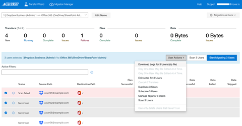

# Mover Transfer logs

>[!Important]
>**Mover is now retired for all Admin led migrations**. The ability to migrate from Google Drive, Box, Dropbox, and Egnyte has been fully integrated into Migration Manager. For full details see: [Mover retirement timeline](mover-retirement-timeline.md).  Migration Manager does not support the migration of Amazon S3 or Azure blob storage.
>
>All FastTrack-led migrations have transitioned to Migration Manager.
>
>**Tenant to tenant migration**. Cross-tenant OneDrive migration is now available outside of Migration Manager. Learn more here: [Cross-tenant OneDrive migration](/microsoft-365/enterprise/cross-tenant-onedrive-migration).  
>
>A cross tenant migration solution for SharePoint is currently being developed and in private preview.  To learn more, see [How to participate in the Cross-tenant SharePoint migration preview](/microsoft-365/enterprise/cross-tenant-sharepoint-migration).

## Viewing your logs

Viewing your logs is an excellent way to troubleshoot transfer issues. They inform you about each action we performed on each file and folder. If we run into any problems, you receive an error message next to the file with a description about what happened.

During a migration, a file sometimes fails to download or upload. All failures are fully logged so you may address them.

> [!NOTE]
> We attempt to copy a file three times before considering it a failure. We only log a failure if we are unable to properly transfer it after three attempts.

You can view a user's transfer logs by doing one of the following:

1. Select the user row. This action opens the **Transfer Logs** sidebar. From here, select **View Log** on any previous transfer log for the selected user.

   

   > [!NOTE]
   > To open a Transfer log in your web browser with built-in sorting and filter features, select **View Log**.

2. To select multiple users, from the **User Actions** dropdown menu or the **Actions** menu in the side tab, select **Download Logs (zip file)**. As the label implies, multiple log files are zipped together for download.

   

   > [!NOTE]
   > The zipped file provides logs in both CSV and HTML formats for only the most recent transfer of each user.

## Interpreting a log file

- **Status**: Whether an action was a success or a failure.
- **Size**: File size in bytes, or that it's a folder being created/operated on.
- **Name**: File, folder, or action being acted upon.
- **Additional Info**: More information about the particular action performed. For more info, see the following table.

|Message|Definition|
|---|---|
|Failed to download file successfully|An issue occurred with the Source Connector.|
|Failed to upload file successfully|An issue occurred with the Destination Connector.|
|Unknown error of type 400|A 'bad request' error. It could be a problem with the Source (File Download) or Destination (File Upload). Typically, this means that something has changed client-side or server-side and could be resolved the next time you run the transfer.|
|Unknown error of type 404|This is a *server not found* error. Typically, this means that the Source (File Download) or Destination (File Upload) server is down or experiencing a temporary outage.|
|Auth failure: attempt to renew authentication successful|Authorization is failing either on the Source (File Download) or Destination (File Upload) Connector.|
|Backoff used: #|Generally seen after an action listed as 'throttle.' This means we've made too many requests of that Connector, and must wait before trying whatever action we were trying to complete again.|
|Folder Already Exists|We attempted to create the folder, but we've already created it in a previous transfer, or it already exists in the destination.|
|Skipping because of incremental|Not an error by definition; it's just our incremental process at work.|
|Scanned|Not an error by definition; it's just our scanner counting your data.|

