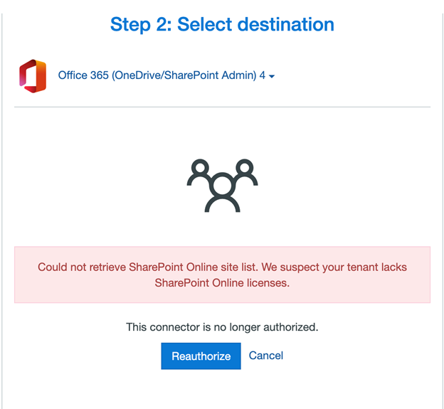

# Troubleshooting an Office 365 connector

>[!Important]
>**Mover is now retired for all Admin led migrations**. The ability to migrate from Google Drive, Box, Dropbox, and Egnyte has been fully integrated into Migration Manager. For full details see: [Mover retirement timeline](mover-retirement-timeline.md).  Migration Manager does not support the migration of Amazon S3 or Azure blob storage.
>
>All FastTrack-led migrations have transitioned to Migration Manager.
>
>**Tenant to tenant migration**. Cross-tenant OneDrive migration is now available outside of Migration Manager. Learn more here: [Cross-tenant OneDrive migration](/microsoft-365/enterprise/cross-tenant-onedrive-migration).  
>
>A cross tenant migration solution for SharePoint is currently being developed and in private preview.  To learn more, see [How to participate in the Cross-tenant SharePoint migration preview](/microsoft-365/enterprise/cross-tenant-sharepoint-migration).

## Connector authorization failure

If your connector authorization fails with **Tenant lacks SPO license** error, then you need to purchase a Microsoft 365 license for your Azure Active Directory tenant. 

For additional information related to Azure Active Directory licenses, see:

-   [What is Azure Active Directory?](/azure/active-directory/fundamentals/active-directory-whatis)   

## App access error

If you encounter an error on authorization, try signing out of any Microsoft accounts, and attempt to authorize the **Connector** in an Incognito Window.

## Global admin account provisioning

Your global admin user must have an Office 365 account provisioned in order to administer other Office 365 accounts. If you create a service account for our app, ensure you also assigned an Office 365 license and walked through the Office 365 setup process.

## User provisioning

Are your Office 365 users provisioned? All Office 365 users must sign in to their Office 365, and open Office 365 for us to transfer into their accounts. You can also provision Office 365 accounts via Windows PowerShell using the following commands (replace your URL and email appropriately):

`Connect-SPOService -Url https://example-admin.sharepoint.com -credential user@example.com`

`Request-SPOPersonalSite -UserEmails "neverloggedintest@example.onmicrosoft.com"`

## Office 365 permission requirements

Our app requires a global admin for authorization. The following table lists the scopes we require:

|**Permission**|**Allows our app to...**|
|:-----|:-----|
|Create, edit, and delete items and lists in all your site collections|Create or delete document libraries and lists in all site collections on your behalf.|
|View your basic profile|See your basic profile (name, picture, user name).|
|Maintain access to data you have given it access to|See and update the data you gave it access to, even when you are not currently using our app. This does not give our app any additional permissions.|
