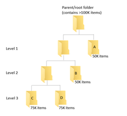

# Migration guidance for ISVs

This document provides guidance for ISVs to deliver a fast and reliable migration experience to customers. It has the latest Microsoft migration practices and addresses common concerns or questions raised by ISV. The page will be updated on regular basis and the priority of the guidance is listed in the order of publication.

## Use app-based authentication
There are different usage patterns between end user traffic and an application doing background activities such as migration. It is important to identify user traffic versus application traffic. 

To provide a stable platform and more reliable service, Microsoft is requesting that ISVs transition from using a user-based authentication to app-based authentication to provide greater reliability to our end users and partners. 

Migration is a background task application and should **not** be run in user mode. By transitioning to app-based authentication, you will benefit from the elastic capability of off-peak time to have more resources.  

> [!Note]
>Microsoft will start enforcing the proper usage roles in Q1 2020. Vendors who continue to run migration in user roles can expect to experience increasing throttling and poor performance.

To learn more on how to register an app ID and how to implement app-based authentication see:

- [How to register an app ID](https://nam06.safelinks.protection.outlook.com/?url=https%3A%2F%2Fdocs.microsoft.com%2Fen-us%2Fazure%2Factive-directory%2Fdevelop%2Factive-directory-v2-registration-portal&data=04%7C01%7CWan.Wu%40microsoft.com%7C7c98484b20de4fc80fb308d6da3e3509%7C72f988bf86f141af91ab2d7cd011db47%7C1%7C0%7C636936358039977299%7CUnknown%7CTWFpbGZsb3d8eyJWIjoiMC4wLjAwMDAiLCJQIjoiV2luMzIiLCJBTiI6Ik1haWwiLCJXVCI6Mn0%3D%7C-1&sdata=L%2BObRVyCBKPwvvY7MUUsWX%2B8yEIbzqaTkBjcmNjc1vk%3D&reserved=0)
- [Microsoft Graph Auth guidance](https://nam06.safelinks.protection.outlook.com/?url=https%3A%2F%2Fdocs.microsoft.com%2Fen-us%2Fgraph%2Fauth%2F&data=04%7C01%7CWan.Wu%40microsoft.com%7C7c98484b20de4fc80fb308d6da3e3509%7C72f988bf86f141af91ab2d7cd011db47%7C1%7C0%7C636936358039977299%7CUnknown%7CTWFpbGZsb3d8eyJWIjoiMC4wLjAwMDAiLCJQIjoiV2luMzIiLCJBTiI6Ik1haWwiLCJXVCI6Mn0%3D%7C-1&sdata=ZrFqXsLT3BtT8ynnlLQH9w7JZIOw07zu2X3EYbBmfD4%3D&reserved=0):   Includes an informative video, basics, how to register your app and getting access scenarios
- [Don’t get throttled! SharePoint and OneDrive guide to staying below the limits](https://www.youtube.com/watch?v=_pBHfGGdMfE)

### App-based authentication migration guidance

#### Permission settings
Azure Active Directory (AAD) provides two type of permission : delegated permission and application permissions. For official AAD guidance please see:

- [Permissions and consent in the Azure Active Directory v1.0 endpoint](https://docs.microsoft.com/azure/active-directory/develop/v1-permissions-and-consent). 

For SharePoint and OneDrive migration scenarios, the guidance is to follow the AAD permission specification. 

For migration tool that relies on end user signed in and presence, delegated permission is recommended. 

For service-based migration tool that run without a signed-in user present such as app that runs as background service, application permission is recommended.

#### Number of App IDs

Questions have been raised by ISV on whether to have a single App ID covering all migration offering products or having multiple App ID per software offering. There is no specific guidance where the ISVs can identify all of their App IDs. Please contact Microsoft for any corner case scenarios. 

>[!Note]
> Please register all your migration app IDs with Microsoft to ensure that you receive adequate throughput for your migration jobs.

## Use the Migration API 
For migration jobs, the first guidance is to use existing published migration APIs.

### Import API (CreateMigrationJob)

The *CreateMigrationJob* helps the ISVs to import to SharePoint and OneDrive faster and more reliably. 

- [Create Migration Job (Import API)](https://docs.microsoft.com/sharepoint/dev/apis/migration-api-overview)

The latest supported features are:

- [Migrate web parts using the Migration API](https://docs.microsoft.com/sharepoint/dev/apis/migrate-webparts-with-migrationapi)

### Export API (Asynchronous Metadata Read)

A new migration API, Asynchronous Metadata Read API (Export API) is  available to ISVs. The *AsynchronousMetadataRead* helps ISVs export content from SharePoint and OneDrive with fast and reduced calls. For example, the new API can export all the files and lists related metadata from the  root level of document library in a single call. This reduces the number of calls needed, the chance of being throttled, and improves performance.

To learn more, see [Asynchronous Metadata Read (Export API)](https://docs.microsoft.com/sharepoint/dev/apis/export-amr-api)

## Switch to the Microsoft Graph API 
If a feature is not supported by the migration API, we recommend that you use the Graph API.  If the Graph API does not support the needed migration feature, then use CSOM. However, using CSOM increases the likelihood of being throttled. 

- [Graph Guidance: Best practices for discovering files and detecting changes at scale](https://docs.microsoft.com/onedrive/developer/rest-api/concepts/scan-guidance?view=odsp-graph-online)

### CSOM Guidance (fallback only)

The following provides guidance on specific CSOM implementation scenarios to help improve migration performance with SharePoint and OneDrive.

#### Enumeration Query Ordering guidance 
There are two kinds of enumeration queries, assuming the client intends to read every item with no server-side filtering.

To query for every item in the list, recursively – in other words, the order does not depend on which folder(s) the items are contained in – the query should sort by ID.

    <OrderBy Override="TRUE"><FieldRef name="ID"/></OrderBy>
 
To query for every item in a specific folder, the query should sort by the filename, **FileLeafRef**.

    <OrderBy Override="TRUE"><FieldRef name="FileLeafRef"/></OrderBy>

## Migration permission guidance

### Unique permission & role assignment limits

For SharePoint and OneDrive, the number of unique ACLs for items in a list or library is limited to 50,000. Calls will fail if you attempt to apply permission on a structure with more than 50,000 unique ACLs. 

While the supported limit is 50,000, the recommended general limit is 5,000. Making changes to more than 5,000 uniquely permissioned items at a time slows migration performance. 

There is a role assignment limit of 5,000 per ACL.
  

### Understanding security scope during migration

There are security and permission limits you need to be mindful of when migrating a source with a large hierarchy of files and folders or one that has too many unique 
permissions.  Before you begin your migration, confirm how many items are in your source or root folder, including lists or other object types.  

#### Permission inheritance
There is a 100,000 limit on the number of items that can be updated or removed as a part of creating a new SharePoint security scope. If you are migrating from a source with a structure that has more than 100,000 children (e.g. files, folders, lists or other object types), you need to structure the migration by importing security in multiple places to avoid exceeding the 100K limit. If the threshold is reached, any VROOM invite, REST share link, or any other permission modifying function call, will trigger HTTP 429 throttles. Permissions will not be updated. 

To learn more about the service limits in SharePoint for Microsoft 365, see [SharePoint Limits](https://docs.microsoft.com/en-us/office365/servicedescriptions/sharepoint-online-service-description/sharepoint-online-limits#items-in-lists-and-libraries).

If you have a folder with greater than 100K items, we recommend one of the following approaches.

#### Method 1:  Restructure the source layout
The first option is to restructure your source layout.

First, scan and determine which folder structure that has greater than 100K items. Remember to evaluate your folder size starting from the lowest level of the folder hierarchy. If you start at the top, VROOM API will always propagate ACLs and you could exceed the limit.

Then restructure the folder structure in the source. For example, divide a single folder of 500K into 5 folders at the root so each folder has less than 100K items.
Make sure that there are no more than 50K unique ACLs in the structure. 

*Example:*
At the source, break up the structure into 4 folders, A, B, C, and D, ensuring each contains less than 100,000 items. Then perform the migration. 

Remember there are other limits that must be considered. See SharePoint limits for details. 
 
#### Method 2
  
The alternate option is to keep your source layout, and instead apply unique ACLs at the key folder level of the migration **destination**.

*Example:*

Your source has over 100K. At your target location, create folders titled A, B, C, and D and apply the unique ACLs and scope ID. This will break the inheritance. Then proceed with your content migration. 

Optionally, if you want to prevent sharing until migration is completed, set the ACL to NULL.

After the incremental migration has completed, and only if you previously set the ACL to NULL, you can reapply the unique ACL for folders A, B, C, D separately.   When you re-apply the ACL, evaluate your folder size starting at the lowest level of hierarchy. See

    

## For migrations over 100TB 

For customers migrating greater than 100TB of data, please follow the instructions on how to create a support ticket to help the product team to prepare the backend for the customers. 

• [Best practices for improving SharePoint and OneDrive migration performance](https://docs.microsoft.com/sharepointmigration/sharepoint-online-and-onedrive-migration-speed). 
 
## Escalation and throttling
 
The primary reason speed is impacted, and throttling occurs, is due to the load that gets generated by calling CSOM and REST APIs. As a result of this load, throttling rules fire that impact the speed, reliability and predictability of the migration. Throttling is used to protect the database and to ensure a good user experience for our customers.
 
To read the official throttling guidance, see:

- [Avoid getting throttled or blocked in SharePoint Online](https://aka.ms/spo429)

We continue to work to identify issues and improve the API. The asynchronous metadata read API is a direct result of ISV feedback. As an ISV/partner, we value your feedback. Please contact Microsoft if you have further questions. 

