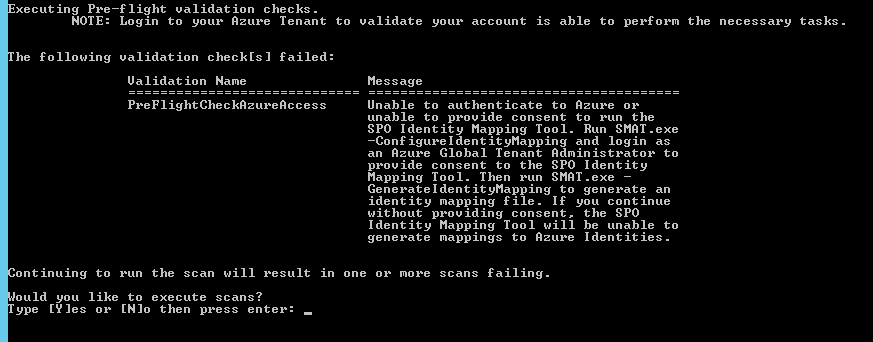
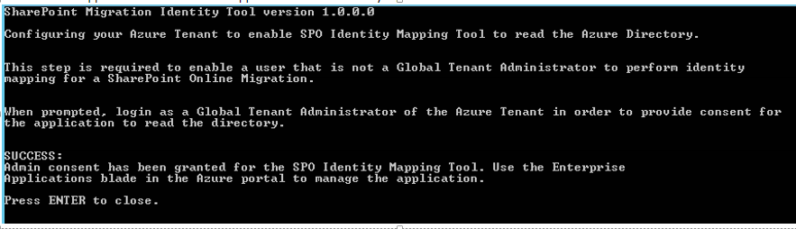

# SharePoint Migration Identity Mapping Tool

Use the Identity Mapping feature of the SharePoint Migration Assessment Tool to assist in your Identity Migration.
  
> [!NOTE]
> To download the SharePoint Migration Tool, click here: [Download the SharePoint Migration Assessment Tool](https://www.microsoft.com/download/details.aspx?id=53598)
  
## Introduction

Identity Migration is the process of mapping identities from the SharePoint on-premises environment to the target-state Azure AD.
  

  
Since the synchronization of users and groups from AD to Azure AD is new to many customers, it is imperative that you assign appropriate resources, perform internal planning, and execute all Identity Migration-related tasks in unison with your overall on-premises migration plan.
  
The most important aspect of the identity project is verification that all needed users and groups are synchronized to Azure Active Directory. If this analysis is not conducted and migration takes place, you may have an issue with users losing access to content if they have not been migrated. 
  
Reference this document for information about the process, roles and responsibilities, artifacts, and controls associated with the One-time Identity Migration process. 
  
## Overview

The goal of the identity migration is to synchronize all possible users and to disposition any remaining unmapped records with justification as to why they are not synchronized. This synchronization and disposition process must be complete prior to preparation of user acceptance testing, (which is Dry Run 1). All unmapped records must have valid justification and be approved by the Microsoft project team. 
  
The SharePoint Migration Identity Management Tool performs identity mapping by running three different scans: 
  
- [SharePoint Migration Identity Mapping Tool: SharePoint Identity Scan](sharepoint-migration-identity-mapping-tool-sharepoint-identity-scan.md)
    
- [SharePoint Migration Identity Mapping: Active Directory Identity Scan](sharepoint-migration-identity-mapping-active-directory-identity-scan.md)
    
- [SharePoint Migration Identity Mapping Tool: Azure Active Directory Identity Scan](sharepoint-migration-identity-mapping-tool-azure-active-directory-identity-scan.md)
    
## Process

This is the process for Users and Groups that have access to SharePoint found in the FullIdentityReport.csv report.
  
Care should be taken to ensure all required users and groups are included in the Azure AD synchronization. If SharePoint content is owned by users who have not been migrated, their user permissions will not be migrated. 
  
The goal is to synchronize 100% of the identities that have access to the source SharePoint environment or provide reasons for any identities that are not synchronized.
  
Initial preparation of all users and groups is needed to determine which users and groups to migrate.
  
- Ideally all users and groups will have TypeOfMatch set to ExactMatch or PartialMatch.
    
- If there are exceptions, these should be noted in the MappingRationale field of the FullIdentityReport.csv file for tracking purposes.
    
 **Steps:**
  
1. Download the assessment tool to a computer in your SharePoint farm. To download, go here: [SharePoint Migration Assessment Tool](https://www.microsoft.com/download/details.aspx?id=53598)
    
2. Provide consent to allow the tool to access your Azure Active Directory.
    
3. Run the following: SMAT.exe -GenerateIdentityMapping 
    
4. Open **FullIdentityReport.csv** in Excel.
    
5. Filter on TypeOfMatch = NoMatch. These users and groups will not have access to content post migration. For example, contoso\johndoe is listed as NoMatch. AclExists is True. Post migration any content that contoso\johndoe had access to on the source will not work for that account post migration. In order to resolve the issue, a site owner will need to add contoso\johndoe's Azure AD account back into permissions.
    
6. Filter on TypeOfMatch = PartialMatch. Ensure the matches we found are correct. It is possible for partial matches to be incorrect if multiple people have the same Display Names or the User Principal Names changed from the source to target. 
    
7. Build a plan to remediate the gaps. For example, if you are using Windows identities and there are users and groups that have TypeOfMatch set to NoMatch or PartialMatch, then you will typically want to sync those additional users and groups to Azure AD and re-run the identity mapping process. 
    
8. Sync additional users and groups to Azure AD. 
    
9. Repeat until you get a FullIdentityReport.csv that properly represents your expectations post migration. 
    
## Pre-flight validation checks

The tool will perform a pre-flight validation check to ensure the operator has access to Azure Active Directory. Access to Azure Active Directory is required to perform the identity mapping process.
  
When prompted, enter Azure AD credentials. If needed the logon prompt will ask for consent. Azure tenant admin consent is required for this application to read Azure Active Directory. 
  
If your logon fails or you are unable to provide consent, you will see the following failure: 
  

  
If you say no at the prompt, the tool will exit without performing any identity mapping scans. 
  
If you choose to continue with the Identity Mapping process, you will receive one more prompt when the Azure Active Directory scan runs. If you are unable to authenticate or provide consent at that point, the Azure Active Directory scan will fail. You will still receive the reports, but mapping will not be performed. The resulting output is representative of all the identities that have access to the source SharePoint environment. 
  
## Configuration File

The identity mapping scans can be configured in the ScanDef.json file located in the same directory as SMAT.exe.
  
## Consent to read directory data

To generate the Identity Mapping Reports, you need to consent to allow assessment tool to read your Azure AD directory. There are two ways to do this: 
  
 **Option 1:** Run the assessment tool with the -ConfigureIdentityMapping switch. 
  
This option will the SPO Identity Mapping tool to your tenant's Enterprise Applications section and allow anyone in your tenant to run the tool to perform identity mapping for migration in Office 365.
  
1. Download the assessment tool from here: [SharePoint Migration Assessment Tool](https://www.microsoft.com/download/details.aspx?id=53598)
    
2. Run: SMAT.exe -ConfigureIdentityMapping
    
    > [!NOTE]
    > It is not required to run this step on the SharePoint environment. You can run the above command on any machine that has access to the Azure tenant.
  
3. When prompted with the Azure logon dialog, enter your Azure tenant admin credentials.
    
4. When prompted for consent, click Accept.
    
5. The SMAT.exe application will indicate the application was successfully registered. A SharePoint admin is now able to run the identity mapping process.
    
     
  
 **Option 2:** Run the assessment tool as a user with Azure Tenant Admin rights. 
  
It is possible for a user with Azure tenant admin rights to run the tool and only provide consent for themselves.
  
1. Download the assessment tool from here: [SharePoint Migration Assessment Tool](https://www.microsoft.com/download/details.aspx?id=53598)
    
2. At the command line, type  `Run SMAT.exe -GenerateIdentityMapping`
    
3. When prompted with the Azure logon dialog, enter your Azure Tenant Admin credentials. 
    
4. When prompted for consent, click OK. This will only consent the app for the logon provided. 
    
5. The identity mapping will run and generate the needed reports. 
    
## Remove Consent

Follow the steps below to remove consent for the SPO Identity Mapping Application from your Azure Tenant. Once these steps have been performed, it will be necessary to provide consent the next time the identity mapping process is ran. 
  
1. Browse https://portal.azure.com 
    
2. Logon as a tenant admin.
    
3. Locate Enterprise applications. 
    
4. Click All applications. 
    
5. Select SPO Identity Mapping Tool in the list of applications and then click **Delete**. 
    
## Reports generated

There are two reports generated by the -GenerateIdentityMapping switch. Each report is used as part of the identity mapping process.
  
Both reports indicate users granted permissions to SharePoint content. 
  
## FullIdentityReport.csv

The FullIdentityReport.csv contains a dump of all the identity data we discovered about the users and groups that were listed as active in the SharePoint environment. The purpose of this report is to understand all the users and groups that have access to SharePoint and whether those identities have an associated Azure AD identity.
  
If the identity is not found in Active Directory, the Active Directory fields will be empty. The FoundInAD field will be false and ReasonNotFoundInAD will contain a reason code. 
  
If the identity was not found in Azure Active Directory, the Azure Active Directory fields will be empty. The FoundInAzureAD field will be false and ReasonNotFoundInAzureAD will contain a reason code. 
  
|**Column name**|**Source**|**Description**|
|:-----|:-----|:-----|
|UniqueID    |SharePoint    |For Windows accounts this will be a Security Identifier (SID). For non-Windows accoutns, this will be the claim used to ACL SharePoint.    |
|TypeOfMatch    |Assessment Tool    |**ExactMatch** - The source identity is a Windows account and we were able to match the SID in SharePoint to the OnPremisesSecurityIdentifier in Azure AD.    **PartialMatch** - The match was based on UserPrincipalName, Email, or Display Name. For groups, we only partial match on Display Name.    **NoMatch** - Unable to match the identity against any information.    |
|IsGroup    |SharePoint    |True if the identity is a group.    |
|ACLExists    |SharePoint    |True if the identity is associated with permissions in SharePoint. This indicates the identity has access to some piece of content.    |
|MySiteExists    |SharePoint    | True if the identity is a user and that user has a My Site/OneDrive associated with their profile.    |
|ClaimType    |SharePoint    |Type of claim authentication mode associated with the identity. This will be one of the following values Classic - These are classic Windows accounts. No claims are involved and the user was ACL'ed using a Windows Security Identifier [SID]. Windows - Windows claims. TrustedSTS - SAML claim provider. Forms - Forms authentication is used. ASPNetMembership - .Net Membership provider. ASPNetRole - .Net Role provider. ClaimProvider - Claims based provider. LocalSTS - Local SharePoint Token Service. https://social.technet.microsoft.com/wiki/contents/articles/13921.sharepoint-20102013-claims-encoding.aspx    |
|SharePointLoginName    |SharePoint    |Login name associated with the identity found in SharePoint.    |
|SharePointDisplayName    |SharePoint    |Display name associated with the identity found in SharePoint.    |
|SharePointProfileEmail    |SharePoint    |Email address associated with the user. This is only populated if the identity is a user, the user has a SharePoint profile, and that profile has an email set.    |
|ActiveDirectoryDisplayName    |Active Directory    |Display name found in Active Directory.    |
|ActiveDirectoryDomain    |Active Directory    |Domain name in which the identity was located.    |
|SamAccountName    |Active Directory    |Account name for the identity. This will be empty for groups.    |
|GroupType    |Active Directory    |Type of group. This will be empty for users.    |
|GroupMemberCount    |Active Directory    |Number of members in the group. This will not reflect nested group counts. For example, if there is a group that contains 3 other groups, this will show as 3. This will be empty for users.    |
|DistinguishedName    |Active Directory    |The distinguished name associated with the identity in Active Directory. Example: CN=Bob Smith,OU=UserAccounts,DC=contoso,DC=com    |
|AccountEnabled    |Active Directory    |True if the account is enabled in Active Directory. This will be empty for groups.    |
|LastLoginTimeInAD    |Active Directory    |Date and time the user account last logged into Active Directory. This does not indicate the logon was associated with SharePoint, but can be used to determine if this is an active user account. This will be empty for groups.    |
|FoundInAD    |Active Directory    |True if the identity was found in Active Directory.    |
|ReasonNotFoundInAD    |Active Directory    |Reason why we did not find the account in Active Directory. This will be one of the following: BadCredentials - The username/password provided was invalid for the domain. DomainSidMatchNotFound - The SID found in SharePoint has a domain SID which does not match any of the located domains. InvalidSecurityIdentifier - The SID found in SharePoint is invalid. OnPremisesSidTranslationFailed - The SID appeared to be invalid, we tried to force a translation and that failed. UnableToConnect - Unable to connect to the domains. UnableToDetermine - We were unable to determine AD properties returned from the domain. UnknownException - An unexpected error occurred. Details are logged in the SMAT.log file. UserNotFoundInRemoteAd - We found a valid domain, but were unable to locate the identity using the SID. This will be empty if FoundInAD is true.    |
|AzureObjectID    |Active Directory    |Object Id of the identity in Azure AD.    |
|AzureUserPrincipalName    |Active Directory    |User principal name of the identity. This is only populated for users.    |
|AzureDisplayName    |Active Directory    |Display name associated with the identity in Azure AD.    |
|FoundInAzureAD    |Active Directory    |True if the identity was located in Azure AD.    |
|ReasonNotFoundInAzureAD    |Active Directory    |Reason why we did not find the account in Azure Active Directory. This will be one of the following: PrincipalNotFound - Unable to locate the identity in Azure AD. AdalExceptionFound - Authentication failure to Azure AD. UnknownException - Unexpected error occurred. Details will be in the SMAT.log file. This will be empty if FoundInAzureAd is true.    |
|MappingRationale    |Active Directory    |This is an open notes field for you to use when tracking down unmapped users.    |
|SanID    |Assessment Tool    |Unique identifier of a particular execution of the identity mapping process. Each time you run the tool, it will generate a distinct Id.    |
   
## IdentityMapping.csv

IdentityMapping.csv is a pre-generated identity mapping file. All identities are represented in the file. Unmapped identities will have blank values for TargetIdentity. 
  
|**Column name**|**Description**|
|:-----|:-----|
|UniqueIdentity    |Uniquevalue to identify the object in the source environment. For Windows identities, this will be the Security Identifier (SID). For all other identity types, this will be the claim found in SharePoint.    |
|TargetIdentity    |Identity to map the source identity to.    For users, this value is the User Principal Name of the user in Azure Active Directory. For groups, this value is the Object Id of the group in Azure Active Directory.    |
|IsGroup    |True if the row represents a group.    |
   
## See also

#### Other Resources

[Download the SharePoint Migration Assessment Tool](https://www.microsoft.com/download/details.aspx?id=53598)
