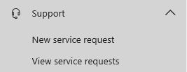
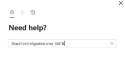
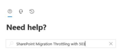

# Guidance for SharePoint Online and OneDrive migration tool speed

>[!Important]
>Many Microsoft SharePoint and Microsoft OneDrive customers run business-critical applications against the service that run in the background. These include content migration, Data Loss Prevention (DLP), and backup solutions. During these unprecedented times, we are taking steps to ensure that SharePoint and OneDrive services remain highly available and reliable for your users who depend on the service more than ever in remote work scenarios.
>
>In support of this objective, we have implemented tighter throttling limits on background apps (migration, DLP and backup solutions) during weekday daytime hours.  You should expect that these apps will achieve very limited throughput during these times. However, **during evening and weekend hours** for the region, the service will be ready to process a significantly higher volume of requests from background apps.

>[!Important]
>**Can Microsoft turn off the throttle to help me with migration?**  **No.** Throttling is in place to protect the reliability and availability of the service. Throttling rules cannot be disabled or suspended. Opening a support ticket will not lift throttle. See the [FAQ and Troubleshooting](#faq-and-troubleshooting) section below for additional information.

This article explains the factors that influence performance when migrating content to SharePoint and OneDrive in Microsoft 365.

Migration performance can be impacted by network infrastructure, file size, migration time, and throttling. Understanding these will help you plan and maximize the efficiency of your migration.

Currently, Microsoft's [SharePoint Migration Tool (SPMT)](https://docs.microsoft.com/sharepointmigration/introducing-the-sharepoint-migration-tool) and other third party vendor tools use the SharePoint API for migration. It leverages Azure and uses channels for large content transfer.  Whatever migration tool you use, these factors will apply. Follow the recommendations listed below for each phase of your migration process.

## Before migration

Planning is the key to optimizing your migration.  Determine what content you need to migrate, prioritize when the content needs to be migrated, and decide on what the optimal migration infrastructure should be.

### I. Scan the source

The first rule of a good migration is to know your source; evaluate and triage your content before you migrate. What content really needs be migrated? What can be left behind? How many file versions should be included? The amount of content you migrate will determine the overall size of your project. 

### II. Package the content
This step is where the tool creates a proper package for the content to be imported into the cloud. This step is automated in SPMT and in most third-party tools. 

**Package size.** To improve migration throughput, we recommend that you package at least 250 files per transfer. For the transfer size, we recommend a minimum of 100 MB and less than 250 MB per package. Keeping within these guidelines will result in a faster upload speed to Azure and leverages the scale capabilities of the migration API.

The following table provides estimates of the type of speed you may achieve based on the types of content you are migrating.  

|**Type of metadata**|**Examples**|**Maximum**|
|:-----|:-----|:-----|
|Light|ISO files, video files |2 TB/day|
|Medium |List items, Office files (~1.5 MB)|1 TB/day|
|Heavy|List items with custom columns, small files (~50 kb)|250 GB /day|

- Large file size migrates faster than smaller ones. Small file size can result in larger overhead and processing time which directly impacts the performance.

- Files migrate faster than objects and list items.

The speed of this step depends on the efficiency of the tool you are using and the type of content that you package. Splitting your packages in a smart way is something that will greatly improve this step. In addition, ensure that your permissions, sharing, or other limits are set up properly for migration and are within [SharePoint limits and boundaries](https://docs.microsoft.com/office365/servicedescriptions/sharepoint-online-service-description/sharepoint-online-limits).

>[!Note]
> If you are planning to migrate over 100TB, review the following section, **Large Migration**.

## During migration

### I. Upload to Azure
SPMT or your third-party tool will migrate your content into SharePoint using the Migration API, leveraging Azure as a temporary holding place.

If you have a good connection and can configure your datacenter, choose the same datacenter location closest geographically to you for your Azure and your Microsoft 365 account. 
Migration data throughput is highest during off-peak hours, which are typically nights and weekends in your region's time zone. Your region's time zone is determined by where your SharePoint tenant is set up.

### II. The Migration API

The final step of the migration process is when the data is moved from Azure to SharePoint. This action is transparent to the user when using SPMT or a third- party tool.

To improve throughput, users are encouraged to run parallel tasks against different site collections if possible. We recommend that you do not submit more than 5,000 migration jobs/requests at one time. Over-queuing the network will create an extra load on the database and slow migration down. Make sure your task has completed before you upload a new migration request. Some tools may already be doing this for you.

During migration, it is not uncommon for your migration task to be throttled. Throttling is implemented to ensure the best user experience and reliability of SharePoint. It is primarily used to load balance the database and can occur if you misconfigure migration settings, such as migrating all your content in a single task or attempting to migrate during peak hours. 

For more technical background and information, please see 
- [Migration API Overview](https://docs.microsoft.com/sharepoint/dev/apis/migration-api-overview) 
- [Avoid getting throttled or blocked in SharePoint](https://go.microsoft.com/fwlink/?LinkID=619858&amp;clcid=0x409)

## After migration
After the migration is completed, verify that your content has been successfully moved to SharePoint or OneDrive.

## Large migrations over 100TB 

If you are planning to migrate over 100TB, please submit a support request following the steps listed below. Make sure to include all requested information.

Follow these steps:
1. Navigate to https://admin.microsoft.com
2. Ensure you are using the new admin center preview.

>[!Note]
>If you are using the old Microsoft 365 admin center you can skip step 8 as the "Description" field will not exist.

3. On the left nav pane, select **Support**, and then select **New Service Request**. 

     

  This will activate the **Need Help?** pane on the right-hand side of your screen.

4.  In the **Briefly describe your issue** area, enter "SharePoint Migration over 100TB". 

     

5. Select **Contact Support**.
6. Under **Description**, enter "SharePoint Migration over 100TB". 
7. Fill out the remaining info, and select **Contact me**.
8. After the ticket has been created, ensure you provide the support agent with the following information:
- Estimated size of your migration.
- An estimate of when you would like to start and complete your migration.
- Where you are migrating your content from, such as SharePoint Server, Box, GDrive, File shares, and so on.

## FAQ and Troubleshooting

**Question: I am experiencing poor performance or throttling during migration.** 
Answer:  Please check the guidance in this document, plus refer to [Avoid getting throttled or blocked in SharePoint](https://docs.microsoft.com/sharepoint/dev/general-development/how-to-avoid-getting-throttled-or-blocked-in-sharepoint-online) for more information on Microsoft throttling guidance. For specific tools configuration or questions, please contact your third party tools vendor for more information.

**Question: I'm continually getting throttled while I am attempting to migrate. Can Microsoft turn off the throttle to help me with migration?** 
Answer: Throttling is in place to protect the reliability and availability of the service. Throttling rules cannot be disabled or suspended and **opening a support ticket will not lift throttle**. Please refer to [Avoid getting throttled or blocked in SharePoint](https://docs.microsoft.com/sharepoint/dev/general-development/how-to-avoid-getting-throttled-or-blocked-in-sharepoint-online) for more information.
  

**Question: If you cannot turn off the throttle, what can I do if I am being throttled or experience poor performance?** 
Answer:  Here are some quick self-help checks to consider: 

- Try to migrate during off-peak business hours
- If you are experiencing slowness, make sure you are not running any unnecessary software which may compete with migration resources. 
- Check with your software provider to ensure you are migrating to SPO/OneDrive using *app-based authentication*.  Migration is a background task and should not be run in user mode. If attempted to migrate in user mode, it can trigger larger than normal throttling.
  

**Question: My migration is blocked with consistent high volume of Http 503 errors ("Server Too Busy") ?** 
Answer: If you are experiencing a high volume of HTTP 503 responses blocking your migration **during evening and weekend hours**, please follow the steps below to create a support ticket.
1. Navigate to https://admin.microsoft.com
2. Ensure you are using the new admin center preview.

>[!Note]
>If you are using the old M365 admin center you can skip step 8 as the "Description" field will not exist.

3. On the left nav pane, select **Support**, and then select **New Service Request**. 

     

 This activates the **Need Help?** pane on the right-hand side of your screen.

4. In the **Briefly describe your issue** area, enter "SharePoint Migration Throttling with 503". 

     

5. Select **Contact Support**.
6. Under **Description**, enter "SharePoint Migration Throttling with 503". 
7. Fill out the remaining info, and select **Contact me**.
8. After the ticket has been created, ensure you provide the support agent with the following information:
    - How much is left of your migration (x TB?). 
    - Migration start and end date.
    - Describe where you are migrating your content from, such as SharePoint Server, Box, GDrive, File shares, and so on. 
    - Estimate the number of throttles (for example, x throttle per hour?) and when (specific time and date) did the throttling happened.
    - Which migration tool you are using (for example, SPMT, Sharegate, Mover, and so on).
  

**Question: If I want to file a Microsoft support ticket, what information should I include?** 
Answer:  Follow these steps and include the following information when filing Microsoft support ticket for any other migration reason:

1. Navigate to https://admin.microsoft.com
2. Ensure you are using the new admin center preview.

>[!Note]
>If you are using the old M365 admin center you can skip step 8 as the "Description" field will not exist.

3. On the left nav pane, select **Support**, and then select **New Service Request**. This activates the **Need Help?** pane on the right-hand side of your screen.

4. In the **Briefly describe your issue** area, enter "SharePoint Migration issue. 
5. Select **Contact Support**.
6. Under **Description**, enter a brief description of your migration issue. 
7. Fill out the remaining info, and select **Contact me**.
8. After the ticket has been created, make sure to include the following information:

    - Your organization URL.
    - How much is left of your migration (x TB?).
    - Migration start and end date.
    - A description of where you are migrating your content from, such as SharePoint Server, Box, GDrive, File shares, and so on.
    - If it is a throttling related escalation, provide information such as the number of throttles, how many throttles per hour, and the specific time and date the throttling happened. If you are experiencing poor performance, please describe the nature of the poor performance.
    - Indicate which migration tool you are using (for example, SPMT, Sharegate, Mover, and so on).
    - State if you are logging in using *user login* or *app-based authentication*.

We welcome feedback and encourage you to submit suggestions or questions that will help us improve the content.
 
## Related Topics

[Avoid getting throttled or blocked in SharePoint](https://go.microsoft.com/fwlink/?LinkID=619858&amp;clcid=0x409)

