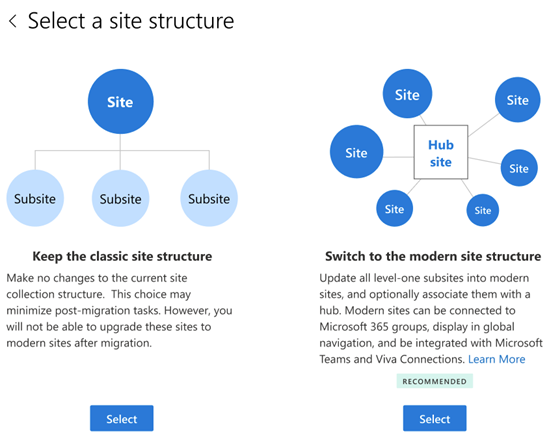
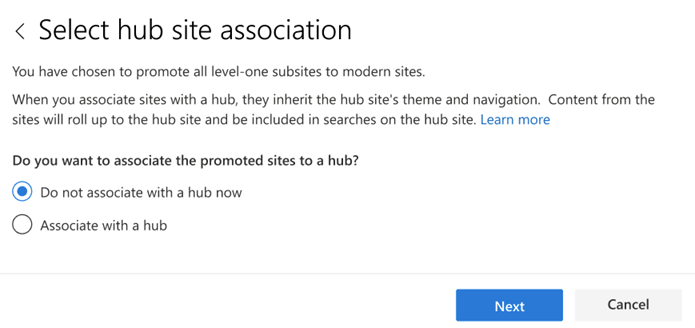
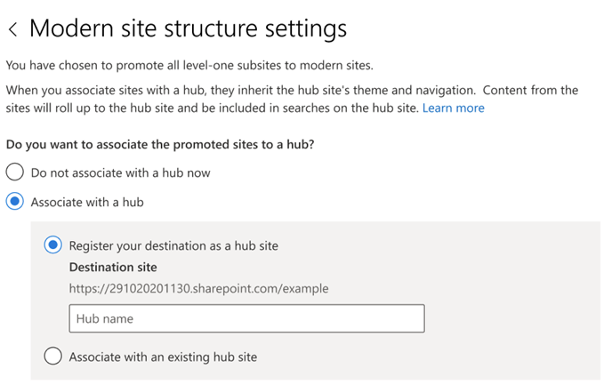
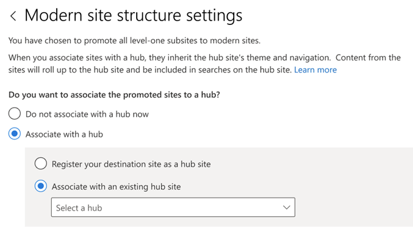
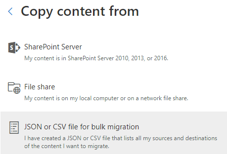

# Step 2: Create a migration task with SPMT

When creating a migration task, you can choose to migrate your sites, just your SharePoint Server lists or document libraries, or choose to modernize your site collection structure.  A bulk method is also available, letting you enter all your task information into a CSV or JSON file and uploading the file into SPMT.

> [!NOTE]
> The site structure feature shown in the "Site migration" steps, is currently in **public preview** and subject to change without notice.

## Migration types

|How|Description|
|:-----|:-----|
|[Site migration](#site-migration)|Migrate a single site or include all your subsites. Optionally you can choose to modernize your site structure during migration.  **Note**. This site structure feature is currently in public preview.)|
|[List and document library migration](#list-and-document-library-migration)|Enter the site and select the document library where your files are located.|
|[Workflow migration](#workflow-migration)|Migrate SharePoint Server workflows to Power Automate.|
|[Bulk migration using a CSV or JSON file](#bulk-migration)|If you have a large number of sources you can enter them into a CSV or JSON file, and upload the file into SPMT.|

## Before you begin

- **Username and password**. When you first open SPMT, you are prompted for your Microsoft 365 username and password. The credentials you provide must be to the migration *destination*.
- **Proxy connections are not supported.** Using Proxy connections yields errors such as "SharePoint login fail" or "cannot load document library".
- If you have already signed in to the destination site already while using SPMT, you won't be prompted again for the same site credentials.

## Site migration

For site migrations, you 

1. Start SPMT, and then enter your Microsoft 365 username and password.
2. Select **Add new migration**.

:::image type="content" source="media/spmt-new-first-action-page.png" alt-text="SPMT first page to take action":::

3. Under **Select a method**, choose **Single source URL**.

:::image type="content" source="media/spmt-select-method.png" alt-text="select method of migration":::

4. Select **Site migration** as your migration type.

:::image type="content" source="media/spmt-select-migration-type.png" alt-text="select your type of migration":::

5. Enter the URL of the SharePoint Server site that you want to migrate, and then select **Next**.
Note:  If not already logged in you may be prompted for the username and password to the SharePoint Server site; it can be UserID or user email. 
6. For site migration, select **This site and all subsites**.
7. Under select a destination, either **Microsoft Teams** or **SharePoint**.
8. Enter the SharePoint site where you want to migrate your content.
9. Select a site structure.  Select either **Keep the classic site structure** (make no changes to the site structure) or **Switch to modern site structure** to modernize your site structure during migration.

    

10. If you chose **Switch to modern site structure**, select if you want the promoted level-one subsites associated with a hub.

   

11. If you chose to associate with a hub, select if you want to register your destination as a hub or associate the sites with an existing hub.

    

12. If you selected to associate the promoted level-one subsites with an existing hub, select the hub name from the dropdown list, and select **Next**.

    

13. Review and edit destination URL for each subsite as needed.

14. Select **Next**. This task is added to the list. If you want to select another set of data files to migrate, select **Add a source**.

## List and document library migration

1. Start SPMT, and then enter your Microsoft 365 username and password.
2. Select Select **Add new migration**.
3. Select **SharePoint Server**.
4. Enter the SharePoint Server site URL where your content is located, and then select **Next**.
5. Enter your username and password to the SharePoint Server site; it can be UserID or user email. Select **Sign in**.
6. Select the document library where your files are located from the dropdown list.
7. Enter the URL of the SharePoint site where you want your files migrated.
8. Select the document library to where your files will be copied.
9. Select **Next**. This task is added to the list. If you want to select another set of data files to migrate, select **Add another task**.

## Workflow migration

> [!TIP]
> For a complete overview and solution on migrating SharePoint Server workflows, see:
>
> - [**Migrating SharePoint Workflows with SPMT**](/sharepointmigration/spmt-workflow-overview)

Steps:

1. Start SPMT, and then enter your Microsoft 365 username and password.
2. Select **Start your first migration**.
3. Select **Workflow migration**.
4. Enter the URL of the SharePoint Server workflow you want to migrate and select which workflows to include in the migration. Select **Next**.
5. Enter your destination; the SharePoint site and list where you want to migrate your content.  If the site or the list doesn't currently exist, they will be created for you. Select **Next**.
6. Review your migrations.  Select **Add another task** to select another set of files to migrate.

## Bulk migration

If you have many sources to migrate, you can use either a JSON or CSV file to do a bulk migration. To learn more on how to create a JSON or CSV file for data content migration, see [How to format your JSON or CSV file for data content migration](how-to-format-your-csv-file-for-data-content-migration.md).

1. Start SPMT, and then enter your Microsoft 365 username and password.
2. Select **Start your first migration**.
3. Select **JSON or CSV file for bulk migration.**

    

4. Enter the full path of your .CSV or .JSON file where your content is located, and then select **Add**.

   > [!NOTE]
   > If you are migrating files from an on-premises SharePoint Server, you will be prompted for your username and password for that site unless you provided those credentials in a previous step.
   >
   > If any errors appear in your file, it is detected on a line-by-line basis. The error indicates which line or lines contain(s) the errors. You cannot proceed until you correct the errors in your file.

5. If you want to select another set of data files to migrate, select **Add another migration**. If not, select **Next**.  Or choose if you want to save this task for later.
6. Review your settings, and the select **Migrate**.

## Resuming migration jobs

If you need to close SPMT before a submitted job has completed, you can restart the tool from any computer.

> [!NOTE]
> To resume a submitted migration job, it has to have been running  *at least* **5 minutes**. It pauses at the point you closed the SPMT. If your submitted job was running less than five minutes before the tool closed, you must resubmit the job.

**To resume migration jobs**:

1. Launch SPMT. Using the same Microsoft 365 username and password you used when you originally submitted the job, select **Sign In**.

2. After you sign in, a screen displays any paused migrations, providing details about what has been completed and what remains.

3. If you want to add more migration tasks, select **Select new sources and destinations**; otherwise, select **Next**. Your migration jobs will be resumed. If you are migrating files from an on-premises SharePoint Server, you are prompted for your username and password for that site.

## Incremental migration

After a migration task has completed, you can save it to be rerun at a later date, allowing you to copy only those new or updated files in the source location.

> [!NOTE]
> If you wish to make changes to this setting, do so before your initial migration job is submitted. This setting is global; it will apply to all subsequent tasks you submit.

When this setting is on, an incremental check of the SharePoint target environment is performed. Files are evaluated as follows:

|Status|Result|
|---|---|
|Modified time of the source file is earlier than the modified time of the target file.|File will not be migrated.|
|Files or lists exist in the SharePoint target location.|Migration will skip those existing objects during scan.|
|Time stamp on files or object in the source location is newer in the source.|The newer files are migrated.|
|Source is a file share.|Validation for migration will be based on the file/folder path.|
|Source is an on-premises SharePoint Server.|Validation for migration will be based on list item GUID. Use the folder path as a fallback.|

>[!Important]
>We strongly recommend that you do not rename or move migrated files before the final migration has been completed.  Doing so will result in files being overwritten.

## [**Step 3: Monitor and reporting status of migrations tasks**](using-the-sharepoint-migration-tool-reports.md)

