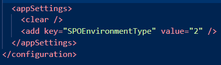

# Troubleshooting SPMT installation issues

If you are having trouble installing the SharePoint Migration Tool, this article provides information on the possible causes and steps to correct the problem.

If after troubleshooting you still are experiencing problems, consider downloading and installing the public preview (beta) of SPMT. It contains the latest updates and fixes. 
[Download SPMT Public Preview](https://spmtreleasescus.blob.core.windows.net/betainstall/default.htm) 

## Common issues

If you are having issues loading the SharePoint Migration tool, here are a few items that are commonly forgotten.

|**Item**|**Requirement**|
|:-----|:-----|
|System architecture| Must be x64|
|.Net version |Must be 4.6.2 or higher. See [How to determine which versions are installed](https://docs.microsoft.com/dotnet/framework/migration-guide/how-to-determine-which-versions-are-installed)|
|Microsoft Visual C++ 2015 Redistributable for X64.|SPMT is trying to add all the redistributions in packages, but missing some system dlls. Trying to install the package might help to resolve all the dependencies. Download: [Microsoft Visual C++ 2015 Redistributable Update 3 RC](https://www.microsoft.com/download/details.aspx?id=52685).|
|Anti-virus| Stop 3rd party anti-virus software on your computer prior to installation.

## **Install errors**

|**Error**|**Suggested action**|
|:-----|:-----|
|"Application SharePoint Migration Tool is already installed from another location".|An unfinished installation may be the cause of this error. Uninstall the tool and then reinstall.|

## Government cloud support

If you are on a government cloud, you must first take these steps:

1. Open microsoft.sharepoint.migration.common.dll.config.
2. Change the value of **SPOEnvironmentType** to:

    - **2** if you are GCC high or DoD
    - **0** if you use the Worldwide consumer cloud or GCC 

     For example:
  
    

3.  Double-click "microsoft.sharepoint.migrationtool.advancedapp.exe" to start SPMT.

>[!Note]
>**0** = Worldwide consumer cloud and GCC 
>**2** = GCC high and DoD 
