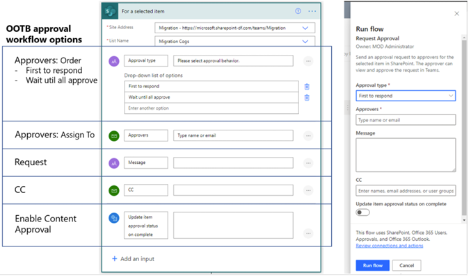

# Migrated flow structure for SharePoint 2010 OOTB workflows

When the Sharepoint Migration Tool (SPMT) migrates a workflow to Power Automate, it finds the Power Automate built-in actions that best match the functions in the original SharePoint workflow. Because of the feature gaps between SharePoint workflow and Power Automate, a converted flow may not carry the exact same behavior as the original one.

SPMT will generate one or two Power Automate flows for one SharePoint workflow depending on its start options. 

- If a workflow can be manually started, a list flow is generated with manual trigger. 
- If a workflow can be auto started on create or update, a list flow is generated with auto-trigger. 

The chart below shows the first action in a flow migrated from an **out-of-the-box (OOTB)** approval workflow (manual start) and the UI form when a user starts the flow. It lists the mapping of five user inputs between original workflow and converted flow.

## Migrated approval workflow

The approval workflow is migrated with this structure:

:::image type="content" source="media/spmt-approval-workflow-steps.png" alt-text="Approval workflow migrated structure":::

For an auto or manually triggered Power Automate flow, the following workflow configurations are migrated to the destination flow:

|Type|Options|
|---|---|
|Manual approval PA flow|Four user inputs are supported in the migrated flow. They are:  - Approval type Options: First to respond, Wait until all approve. - Approvers. Emails - Request. Text - CC. Emails - Enable Content Approval. On/Off|
| Auto triggered PA flow|The following configurations in workflow are migrated to destination flow.  - The approval type, **Everyone must approve** is used in the destination flow. - Approvers. Emails - Request. Text - CC. Emails - Enable Content Approval. On/Off|

## Migrated collect feedback workflow

The collect feedback workflow is migrated with this structure:

:::image type="content" source="media/spmt-collect-signature-workflow-steps.png" alt-text="Collect feedback workflow migrated structure":::

For an auto or manually triggered Power Automate flow, the following workflow configurations are migrated to the destination flow:

|Type|Options|
|---|---|
|Manual approval PA flow|Three user inputs are supported in the migrated flow. They are:   - Reviewers. Emails - Request. Text - CC. Emails|
| Auto triggered PA flow|The following configurations in workflow are migrated to destination flow. They are:   - Reviewers. Emails - Request. Text - CC. Emails|

## Migrated collect signature workflow

The collect signature workflow is migrated with this structure:

:::image type="content" source="media/spmt-collect-signature-workflow-steps.png" alt-text="Collect signature migrated structure":::

For an auto or manually triggered Power Automate flow, the following workflow configurations are migrated to the destination flow:

|Type|Options|
|:-----|:-----|
|Manually triggered collect feedback| Before starting a workflow, three user inputs are supported in the migrated flow. They are: - Signer order maps to Signer type. Options: First to respond, Wait until all approve -Signers maps to Signers. Emails -Request maps to Message. Text - CC maps to CC. Emails|
|Auto triggered collect feedback|Signer order maps to Signer type. “Everyone must approve” is used in migrated flow. - Signers maps to Signers. Emails - Request maps to Message. Text - CC maps to CC. Emails|
|

## Migrated three-state workflow

The three state workflow is migrated with this structure:

:::image type="content" source="media/spmt-three-state-workflow-steps.png" alt-text="Three state workflow structure":::

For auto or manual triggered three state Power Automate flow, the following configurations in workflow are migrated to destination flow.  The workflow states are:

- StatusField (Status field name)
- InitialState (Initial state value)
- MiddleState (Middle state value)
- FinalState (Final state value)

|Type|State|Details|
|:-----|:-----|:-----|
|Task |Initial|**Task Title** -CustomMessageText (custom message) -CustomMessageField (Field included in task title)  **Task Description** CustomMessageTextBody (Task description/custom message) CustomMessageBodyField (Field included in task body)  **Task Assign To** - TaskAssignedToCustom (Task assigners is the value of an item field, or Task assigners are customized) -AssignedToField (Task assigner field) -CustomAssignedTo (Customized task assigners)|
|Email message|Initial|- SendEmail (Whether to send email) - IncludeTaskAssignedTo (Whether to include task assigner in to-list) - ToList (Email to-list) - SubjectTextIncludeTitle (Whether to include task title in email subject text) - SubjectText (Email subject text) - BodyTextIncludeLink (Whether to include item link in email message) - BodyText (Email body text) |
|Task|Middle|**Task Title** - CustomMessageText2 (custom message) - CustomMessageField2 (Field included in task title) **Task Description** - CustomMessageTextBody2 (Task description/custom message) - CustomMessageBodyField2 (Field included in task body) **Task Assign To** - TaskAssignedToCustom2 (Task assigners is the value of an item field, or Task assigners are customized) - AssignedToField2 (Task assigner field) - CustomAssignedTo2 (Customized task assigners)|
|E-mail message| Middle|- SendEmail2 (Whether to send email)  - IncludeTaskAssignedTo2 (Whether to include task assigner in to-list)  - ToList2 (Email to-list)  - SubjectTextIncludeTitle2 (Whether to include task title in email subject text)  - SubjectText2 (Email subject text)  - BodyTextIncludeLink2 (Whether to include item link in email message) - BodyText2 (Email body text)|
