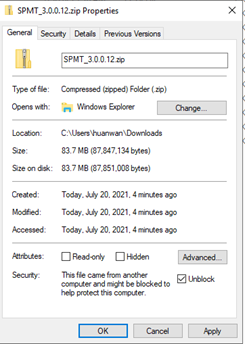

# Migrate SharePoint Server workflows to Microsoft 365 User Guide (preview)

Microsoft removed SharePoint 2010 workflow services from existing tenants on November 1, 2020. We recommend that you move your classic SharePoint workflows to Power Automate flows. 

This document describes the tool, released with SPMT, which helps customers autoconvert workflow to Power Automate.


The SharePoint Migration tool workflow migration is limited to:

•	List and library OOB ("out-of-box) approval workflows
•	Workflow definitions and associations

History data and draft definitions are not migrated. 

## Prerequisites 

The following endpoints are required by workflow migration.

•	https://service.powerapps.com 
•	https://api.bap.microsoft.com
•	https://gov.service.powerapps.us
•	https://gov.api.bap.microsoft.us
•	https://high.service.powerapps.us
•	https://high.api.bap.microsoft.us
•	https://service.apps.appsplatform.us
•	https://api.bap.appsplatform.us


## Configure Power Automate 

If your tenant has never used Power Automate before, you must configure it before you begin migration. We recommend using Edge or Internet Explorer.

1.	Sign in to https://admin.powerplatform.microsoft.com/ using an admin account.
2.	Select **Add database** to your default environment.


3.	Wait for "State" status to change to **Ready**.
4.	To sync AAD user to CDS, sign in to **Microsoft Power Automate | Microsoft Power Platform** with the account you’d like to set as the default flow owner.


## Installation

Follow the steps below to install the SPMT private build with supporting workflow migration.

1.	Download SPMT_buildnumber.zip file from the link shared to you.
2.	Right-click on the zip file, select properties menu item. check “Unblock” in General->Security, then click OK to save the change.



3.	Unzip the package under a folder, also known as SPMT binary folder.
4.	Copy the attached sample files under the SPMT binary folder. Replace values of variables in the scripts with the right ones of your own environment. The PowerShell scripts can be placed in folder other than SPMT binary folder. Make sure you change the path of “Import-Module” to SPMT binary folder.
 
## Migrate workflow to Power Automate

PowerShell is available to help users migrate workflows to PA flows. 

### Scan workflows

This command scans workflows of a given site or list and generates a scan report. 

```powershell

Register-SPMTMigration -ScanOnly $true -SPOCredential $targetCredential -UserMappingFile $userMappingFile -MigrationType WORKFLOW -DefaultFlowOwnerEmail  $defaultOwnerName -Force
...
Start-SPMTMigration

```

### Migrate workflows

This command migrates workflows to Power Automate. It migrates workflow of given site or list, generate a migration package, import the package to PA and generate a migration report. 

**MigrationType**

When MigrationType is WORKFLOW, if the structure has not been migrated yet, the command does migrate site or list structure (not content), then migrate its workflows.

**DefaultFlowOwnerEmail**

Default flow owner is required for OOTB Approval workflow because there isn’t an owner in workflow definition. After migration, only flow owner and Power Automate admin can access the migrated flows. If the given owner email is not a valid user at destination, migration will fail. The flow owner also needs to have permission to access the destination SPO list.

```powershell

> Register-SPMTMigration -SPOCredential $targetCredential -UserMappingFile $userMappingFile -MigrationType WORKFLOW -DefaultFlowOwnerEmail $defaultOwnerName -Force
...
Start-SPMTMigration

```

## Migrations report

The migration task generates workflow migration report as WorkflowMigrationReport.csv file under WF_xxx/Report/TaskReport_xxx/ folder. 

|Column name|Notes|
|:-----|:-----|
|Source association url|Source SharePoint object URL that associated with the workflow. Can be URL of list, library, site |
|Destination association url|Destination SharePoint object URL that associated with the migrated Power Automate flow. Can be URL of list, library.|
|Source workflow url||	
|Destination workflow url||	
|Source workflow ID||	
|Destination flow ID||
|Source workflow name||	
|Destination flow name||		
|Solution name|The name of Power Automate solution that contains migrated flows. Flow owner can find migrated flows in the solution.| 
|Source workflow owner|	The creator of source workflow instance|
|Destination flow owner|The owner(s) of migrated PA flow|
|Association type|Possible values: List, Site, or content type|
|Workflow version|Possible values: Workflow2010, Workflow2013|
|Workflow template name||	
|Status|Possible values: Migrated, Failed, or skipped|
|Result category|Possible values: Migrated, SCAN FILTER, SCAN FAILURE, FLOW CREATE FAILURE|
|Message|Error message|
|Error code||

## Activate migrated flows

After the migration has completed, the flow owner must sign in to Power Automate to turn on the migrated flows.

1.	Sign in Power Automate
2.	Navigate to **Solutions**, choose the latest one matching “Solution” in migration report.
3.	Edit connection references. Create new connection if there is no existing connection found. Pick an existing connection to a connection reference is recommended.
 
4.	Turn on flow after all connection references are configured.
 

After the migrated flows are turned on, testing is suggested to verify the behavior of the flows.


## The migrated flows

When SPMT migrates workflows to Power Automate, the transformation uses the modern Power Automate capabilities. An easy process lets you create the same or similar business requirements as in the original SharePoint workflows.

|Type|Options|
|:-----|:-----|
|List workflow|Manual start on selected item will have a new list flow with manual trigger, also known as *LIST_MANUAL_APPROVAL*.</br>Trigger by new item and update item will have a new list flow with auto trigger, also known as *LIST_AUTO_APPROVAL*.|
|Document library|Manual start on selected file will have a new file flow with manual trigger, also known as *FILE_MANUAL_APPROVAL*<br/>Trigger by new file and update file will have a new file flow with auto trigger, also known as *FILE_AUTO_APPROVAL*.|
|Manual approval PA flow|Four user inputs are supported in the migrated flow. They are: </br>- Approval type Options: First to respond, Wait until all approve.<br>- Approvers. Emails<br>- Request. Text<br>- CC. Emails<br>- Enable Content Approval. On/Off|
| Auto triggered PA flow|The following configurations in workflow are migrated to destination flow. </br>- The approval type, **Everyone must approve** is used in the destination flow.</br>- Approvers. Emails</br>- Request. Text</br>- CC. Emails</br>- Enable Content Approval. On/Off|

 
