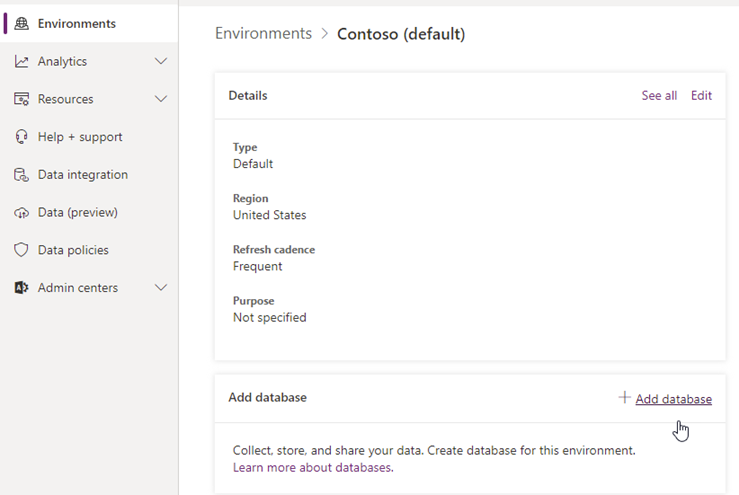

# Step 1 - Configure endpoints and Power Automate

> [!NOTE]
> This feature is currently in public preview, and subject to change.

Before you begin your workflow migration, configure the required endpoints

## Configure endpoints

The following endpoints are required by workflow migration.

|Endpoint|
|---|
|<https://service.powerapps.com>|
|<https://api.bap.microsoft.com>|
|<https://gov.service.powerapps.us>|
|<https://gov.api.bap.microsoft.us>|
|<https://high.service.powerapps.us>|
|<https://high.api.bap.microsoft.us>|
|<https://service.apps.appsplatform.us>|
|<https://api.bap.appsplatform.us>|

## Configure Power Automate

If you have never used Power Automate with this tenant before, you must configure it before you begin migration. We recommend using Edge or Internet Explorer.

1. Sign in to https://admin.powerplatform.microsoft.com/ using an admin account.
2. Select **Add database** to your default environment.

   

3. Wait for "State" status to change to **Ready**.
4. To sync a Microsoft Entra user to CDS, sign in to **Microsoft Power Automate | Microsoft Power Platform** with the account you'd like to set as the default flow owner.

>[!Important]
>The user account you use to migrate must be a global admin or OneDrive/SharePoint admin on the Microsoft 365 tenant, and be a Power Automate admin who can manage the solution.
>
>As this user account will be used to create solutions and users in the Power Platform environment, it must also be assigned with the security roles of System Administrator, Environment Maker and Basic User.[Learn more about Power Platform data security](/power-platform/admin/database-security).
>
>Sign in to Power Automate using this account, navigate to Solutions, and verify you can create a new solution.

## Step 2:  [Migrate Workflows](spmt-workflow-step2.md)
