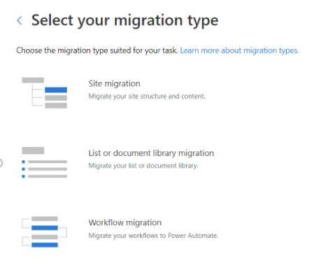
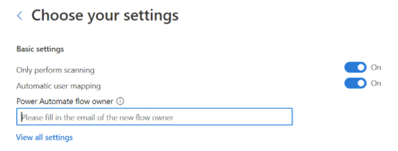

# Step 2 Migrate workflows to Power Automate

> [!NOTE]
> This feature is currently in public preview, and subject to change.

After configuring the required endpoints and configuring Power Automate, you are ready to start migrating your SharePoint Server workflows.

1. Start SPMT, and then enter your Microsoft 365 username and password.
2. Select **Start your first migration**.
3. Select **SharePoint Server**.
4. Select the **Workflow migration** type.

   

5. Enter the URL of the SharePoint Server workflow you want to migrate.
6. Enter your username and password to the SharePoint Server site; it can be UserID or user email. Select **Sign in**.
7. Select which workflows to include in the migration. If you select the option for a specific list, you will be prompted for the list name.  Select **Next**.

   

8. Enter your destination; the SharePoint site and list where you want to migrate your workflow.  If the site or the list doesn't currently exist, they will be created for you. Select **Next**.
9. This task is added to the list of migration tasks.  If you want to select another set of data files to migrate, select **Add a source**.  Otherwise, select **Next** to go to the next step.
10. On the settings page, turn on **Only perform scanning** to run workflow scanning.
11. In the **Power Automate flow owner** box, enter the email address of the new flow owner.

    

12. Review your migrations.  Select **Add another task** to select another set of files to migrate, or Next to submit migration.

    

## Migrations report

The migration task generates a workflow migration report titled *WorkflowMigrationReport.csv*.  The file under WF_xxx/Report/TaskReport_xxx/ folder.

|Column name|Notes|
|---|---|
|Source association url|Source SharePoint object URL that associated with the workflow. Can be URL of list, library, site|
|Destination association url|Destination SharePoint object URL that associated with the migrated Power Automate flow. Can be URL of list, library.|
|Source workflow url|Location of the source workflow.|
|Destination workflow url|The location where the workflow will be migrated.|
|Source workflow ID||
|Destination flow ID||
|Source workflow name||
|Destination flow name||
|Solution name|The name of Power Automate solution that contains migrated flows. Flow owner can find migrated flows in the solution.|
|Source workflow owner|The creator of source workflow instance|
|Destination flow owner|The owner(s) of migrated PA flow|
|Association type|Possible values: List, Site, or content type|
|Workflow version|Possible values: Workflow2010, Workflow2013|
|Workflow template name||
|Status|Possible values: Migrated, Failed, or skipped|
|Result category|Possible values: Migrated, SCAN FILTER, SCAN FAILURE, FLOW CREATE FAILURE|
|Message|Error message|
|Error code||

## Step 3:  [Activate workflows](spmt-workflow-step3.md)
