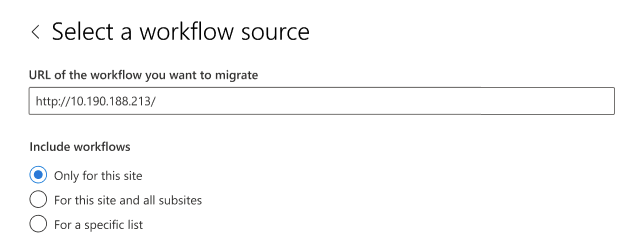

# Step 2 Migrate workflows to Power Automate

> [!NOTE]
> This feature is currently in public preview, and subject to change.

After configuring the required endpoints and configuring Power Automate, you are ready to start migrating your SharePoint Server workflows. You choose to either use SPMT or PowerShell.

## Migrate workflows using SPMT

1. Start SPMT, and then enter your Microsoft 365 username and password.
2. Select **Start your first migration**.
3. Select **SharePoint Server**.
4. Select the **Workflow migration** type.
</br>

   

5. Enter the URL of the SharePoint Server workflow you want to migrate.
6. Enter your username and password to the SharePoint Server site; it can be UserID or user email. Select **Sign in**.
7. Select which workflows to include in the migration. If you select the option for a specific list, you will be prompted for the list name.  Select **Next**.

   

8. Enter your destination; the SharePoint site and list where you want to migrate your workflow.  Select the workflow environment. If the site or the list doesn't currently exist, they will be created for you. Select **Next**.

   

9. This task is added to the list of migration tasks.  If you want to select another set of data files to migrate, select **Add a source**.  Otherwise, select **Next** to go to the next step.
10. On the settings page, turn on **Only perform scanning** to run workflow scanning.
11. In the **Power Automate flow owner** box, enter the email address of the new flow owner.

    

12. Review your migrations.  Select **Add another task** to select another set of files to migrate, or Next to submit migration.


## Migrations report

The migration task generates a workflow migration report titled *WorkflowMigrationReport.csv*.  The file under WF_xxx/Report/TaskReport_xxx/ folder.

|Column name|Notes|
|---|---|
|Source association url|Source SharePoint object URL that associated with the workflow. Can be URL of list, library, site|
|Destination association url|Destination SharePoint object URL that associated with the migrated Power Automate flow. Can be URL of list, library.|
|Source workflow url|Location of the source workflow.|
|Destination workflow url|The location where the workflow will be migrated.|
|Source workflow ID||
|Destination flow ID||
|Source workflow name||
|Destination flow name||
|Solution name|The name of Power Automate solution that contains migrated flows. Flow owner can find migrated flows in the solution.|
|Source workflow owner|The creator of source workflow instance|
|Destination flow owner|The owner(s) of migrated PA flow|
|Association type|Possible values: List, Site, or content type|
|Workflow version|Possible values: Workflow2010, Workflow2013|
|Workflow template name||
|Status|Possible values: Migrated, Failed, or skipped|
|Result category|Possible values: Migrated, SCAN FILTER, SCAN FAILURE, FLOW CREATE FAILURE|
|Message|Error message|
|Error code||


## Migrate workflows using PowerShell

Alternatively, you can migrate your workflows to Power Automate using PowerShell.  
Before you proceed, make sure you have completed the steps in this article: [Step 1 - Configure endpoints and Power Automate](spmt-workflow-step1.md).

### Scan workflows

This command scans workflows of a given site or list and generates a scan report. 

```powershell

Register-SPMTMigration -ScanOnly $true -SPOCredential $targetCredential -UserMappingFile $userMappingFile -MigrationType WORKFLOW -DefaultFlowOwnerEmail  $defaultOwnerName -Force
...
Start-SPMTMigration

```

### Migrate workflows

This command does the following:

- Migrates workflow of a site or list
- Generates a migration package
- Imports the package to Power Automate and 
- Generates a migration report. 

**MigrationType**

When MigrationType is WORKFLOW, if the structure hasn't been migrated yet, the command does migrate site or list structure (not content), then migrate its workflows.

**DefaultFlowOwnerEmail**

Default flow owner is required for OOTB Approval workflow because there isn’t an owner in workflow definition. After migration, only flow owner and Power Automate admin can access the migrated flows. If the given owner email isn't a valid user at destination, migration will fail. The flow owner also needs to have permission to access the destination SPO list.

```powershell

> Register-SPMTMigration -SPOCredential $targetCredential -UserMappingFile $userMappingFile -MigrationType WORKFLOW -DefaultFlowOwnerEmail $defaultOwnerName -Force
...
Start-SPMTMigration

```


### Sample PowerShell script

```powershell

Import-Module "$((Resolve-Path .\).Path)\Microsoft.SharePoint.MigrationTool.PowerShell.dll"

clear
Remove-Variable * -ErrorAction SilentlyContinue

$currentFolder = (Resolve-Path .\).Path
$userMappingFile = "$($currentFolder)\Sample-UserMap.csv"
$defaultOwnerName = "please enter flow owner email here"

$targetSite = "please enter destination site URL here"
$targetUserName = "please enter destination site admin user email here"
$targetPassWord = ConvertTo-SecureString -String "please enter destination user password here" -AsPlainText -Force 
$targetCredential = New-Object -TypeName System.Management.Automation.PSCredential -ArgumentList $targetUserName, $targetPassWord

Register-SPMTMigration -SPOCredential $targetCredential -UserMappingFile $userMappingFile -IgnoreUpdate -MigrationType WORKFLOW -DefaultFlowOwnerEmail $defaultOwnerName -Force

$sourceSite = "please enter source site URL here"
$sourceUsername = "please enter source site admin username here"
$sourcePassword = ConvertTo-SecureString -String "please enter destination user password here" -AsPlainText -Force
$sourceCredential = New-Object -TypeName System.Management.Automation.PSCredential -ArgumentList $sourceUsername, $sourcePassword
Add-SPMTTask -SharePointSourceCredential $sourcecredential -SharePointSourceSiteUrl $sourceSite -TargetSiteUrl $targetSite `
#-SourceList "please enter source list name here" -TargetList "please enter destination list name here"

Write-Host "Start migration"
$StartTime = [DateTime]::UtcNow

# Let the migration run in background using NoShow mode
Start-SPMTMigration

$migration = Get-SPMTMigration

# open report folder
start $migration.ReportFolderPath

```


## Step 3:  [Activate workflows](spmt-workflow-step3.md)
